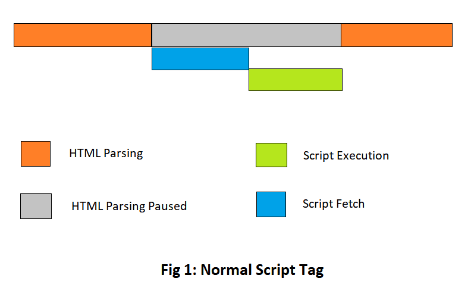
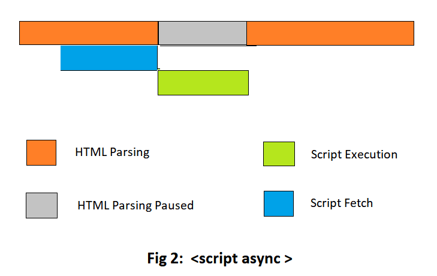
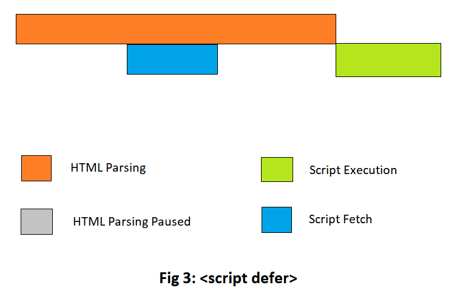

# What is JavaScript?

- created to `make web pages alive`

- `lightweight`, `prototype - based`, `single - threaded`, `dynamic language`, `object - oriented`, `interpreted` or `just-in-time compiled` programming language

- can execute not only in the `browser`, but also on the `server` <br/>eg.`Node.js`,`Apache CouchDB`

- JavaScript engines :
  - ` "V8" – in Chrome, Opera and Edge`
  - `"SpiderMonkey" – in Firefox`
  - `"Chakra" - in IE`
  - `"JavaScriptCore", "Nitro" and "SquirrelFish" - in Safari`, etc

# Why is it called JavaScript?

- It initially had another name: `LiveScript`

* But `Java` was very popular at that time, so it was decided that positioning a new language as a `younger brother of Java` would help

# How do engines (translator) work?

```
parse(read)  =>  compiles(translate)  =>  run
```

# How to link with HTML ?

- for `inline` js

  ```html
  <a href="#" onclick="alert(this)">Click Me</a>
  ```

- for `internal` file

  ```html
  <script>
    ....
  </script>
  ```

- for `external` file

  ```html
  <script src="path/to/script.js"></script>
  ```

# Async Vs Defer In Javascript

## Normal `<script>` tag

```html
<html>
<head> ... </head>
<body>
    ...
    <script src="script.js">
    ....
</body>
</html>
```

- JS `blocks` the parsing of HTML
- `fetches` the script from the network
- `Executes` the script
- HTML parsing is started only after the `script is fully executed`



## The async Attribute

```html
<script async src="script.js">
```

- `HTML parsing` and `script fetched` from the network goes asynchronously

- As soon as scripts are `fetched`, HTML parsing `stops` & scripts start `executing`

- Once the scripts are executed, the HTML parsing continues like regular



## The defer Attribute

```html
<script defer src="script.js">
```

- HTML parsing goes on and scripts are fetched in `parallel`

- Scripts are only `executed` once the HTML `parsing is complete`



## Which one to use?

- `async` attribute does not guarantee the order of execution of scripts but `defer` does

- So for this, we can use an alternative solution which is to use the `<script>` tag just before the `<body>` tag of the HTML file.

# What is “use strict” ?

- always at the `top` of your scripts

- with Strict mode you cannot use any variable before initializing it.

```js
// note: no "use strict" in this example

num = 5; // the variable "num" is created if it didn't exist

alert(num); // 5
```

```js
"use strict";

num = 5; // error: num is not defined
```

- Declared inside a `function`, it has `local scope` (only the code inside the function is in strict mode)

```js
x = 3.14; // This will not cause an error.
myFunction();

function myFunction() {
  "use strict";
  y = 3.14; // This will cause an error
}
```

- `Modern JS` supports “classes” and “modules” – advanced language structures, that `enable use strict automatically`. So we don’t need to add the "use strict" directive, if we use them.

# Alert, Prompt and Confirm

## alert

- `shows a message` and waits for the user to press “OK”

```js
alert("Hello");
```

## prompt

- `takes input` from user
- The function prompt accepts `two` arguments:

```js
result = prompt(title, [default]);

let age = prompt('How old are you?', 100);

alert(`You are ${age} years old!`); // You are 100 years old!
```

## confirm

- The function confirm `shows a modal` window with a question and two buttons: `OK` and `Cancel`

- The result is `true if OK` is pressed and `false otherwise`

```js
let isBoss = confirm("Are you the boss?");

alert(isBoss); // true if OK is pressed
```
