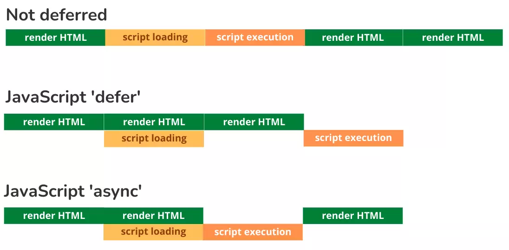

# What is JavaScript?

- created to `make web pages alive`

- `lightweight`, `prototype - based`, `single - threaded`, `dynamic language`, `object - oriented`, `interpreted` or `just-in-time compiled` programming language

- can execute not only in the `browser`, but also on the `server` <br/>eg.`Node.js`,`Apache CouchDB`

- JavaScript engines :
  - ` "V8" – in Chrome, Opera and Edge`
  - `"SpiderMonkey" – in Firefox`
  - `"Chakra" - in IE`
  - `"JavaScriptCore", "Nitro" and "SquirrelFish" - in Safari`, etc

# How do engines (translator) work?

```
parse(read)  =>  compiles(translate)  =>  run
```

# How to link with HTML ?

- for `inline` js

  ```html
  <a href="#" onclick="alert(this)">Click Me</a>
  ```

- for `internal` file

  ```html
  <script>
    ....
  </script>
  ```

- for `external` file

  ```html
  <script src="path/to/script.js"></script>
  ```

# Async Vs Defer

- `async` attribute : script will be **fetched in parallel to html parsing** and **executed as soon as it is available** (potentially before parsing completes).

- `defer` attribute : script will be **fetched in parallel** and **executed when the page has finished parsing**



# What is “use strict” ?

- always at the `top` of your scripts
- `purpose` is to indicate that the code should be `executed in "strict mode"`
- makes it `easier to write "secure" JavaScript`
- changes previously accepted `"bad syntax" into real errors`

- eg.

```js
// Using a variable, without declaring it, is not allowed:
"use strict";
num = 5; // error: num is not defined

// Deleting a variable (or object) is not allowed.
let x = 3.14;
delete x; // This will cause an error

function x(p1, p2) {}
delete x; // This will cause an error

// Duplicating a parameter name is not allowed:
function x(p1, p1) {} // This will cause an error
```

# Alert, Prompt and Confirm

## alert

- `shows a message` and waits for the user to press “OK”

```js
alert("Hello");
```

## prompt

- `takes input` from user
- The function prompt accepts `two` arguments:

```js
result = prompt(title, [default]);

let age = prompt('How old are you?', 100);

alert(`You are ${age} years old!`); // You are 100 years old!
```

## confirm

- The function confirm `shows a modal` window with a question and two buttons: `OK` and `Cancel`

- The result is `true if OK` is pressed and `false otherwise`

```js
let isBoss = confirm("Are you the boss?");

alert(isBoss); // true if OK is pressed
```
