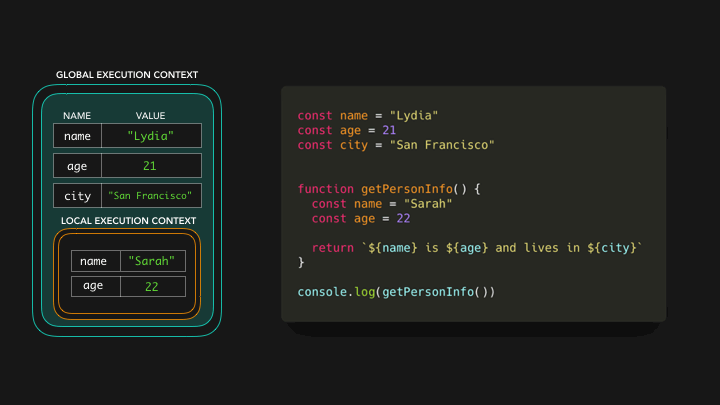

# Variables

- used to `store information` and use them later

```js
let message = "Hello";

alert(message); // Hello
```

- `declare multiple variables` in one line
  <br/>

```js
let user = "John",
  age = 25,
  message = "Hello";
```

## Variable naming

- name must contain `only letters`, `digits`, or the symbols `$ and _`

```js
let userName;
let test123;

let $ = 1; // declared a variable with the name "$"
let _ = 2; // and now a variable with the name "_"
alert($ + _); // 3
```

- `first` character must `not be a digit`

```js
let 1a;
```

- hyphens `-` are `not allowed` in the name

```js
let my-name;
```

- `Case sensitive`

```js
// both variables are different
let apple = "...";
let APPLE = "...";
```

- `Non-Latin` letters are `allowed`, but `not recommended`

```js
let имя = "...";
```

- `can't use reserved words`

```js
let let = 5;
let return = 5;
```

## `var` vs `let` vs `const`

|                                           | var                                            | let                                            | const                                               |
| ----------------------------------------- | ---------------------------------------------- | ---------------------------------------------- | --------------------------------------------------- |
| `Redeclaration`                           | YES                                            | NO                                             | NO                                                  |
| `Reassignment`</br>(can change its value) | YES                                            | YES                                            | NO                                                  |
| `Must be Assigned while declaration`      | NO<br/>var name;<br/>name = 'Shubham'; //valid | NO<br/>let name;<br/>name = 'Shubham'; //valid | YES<br/>const PI;<br/>PI = 3.14159265359; //invalid |
| `Block Scope`                             | NO<br/>(functional scope)                      | YES                                            | YES                                                 |

- If you re-declare with `var` only, it will not lose its value.

```js
var carName = "Volvo";
var carName; // Volvo

-----------------------

let message = "This";
let message = "That"; // SyntaxError: 'message' has already been declared
```

# scope

- A variable can be declared at `different scope`
- there are 4 kinds of scope in Javascript - `Block Scope`, `Global Scope`, `Function Scope`, `Module Scope`

- Anything declared `without let, var or const` is scoped at `global level`

```js
//scope.js
b = 10; // this is a global scope
```

## Global scope

- A globally declared variable can be `accessed every where in the same file`

```js
//scope.js
let a = "JavaScript"; // is a global scope
let b = 10; // is a global scope
function letsLearnScope() {
  console.log(a, b); // JavaScript 10, accessible
  if (true) {
    let a = "Python";
    let b = 100;
    console.log(a, b); // Python 100
  }
  console.log(a, b);
}
letsLearnScope();
console.log(a, b); // JavaScript 10, accessible
```

## Local scope

- A variable declared as local can be accessed only in certain block code
  1. `Block Scope`
  2. `Function Scope`

```js
//scope.js
let a = "JavaScript"; // is a global scope
let b = 10; // is a global scope

// Function scope
function letsLearnScope() {
  console.log(a, b); // JavaScript 10, accessible
  let value = false;
  // block scope
  if (true) {
    // we can access from the function and outside the function but
    // variables declared inside the if will not be accessed outside the if block
    let a = "Python";
    let b = 20;
    let c = 30;
    let d = 40;
    value = !value;
    console.log(a, b, c, value); // Python 20 30 true
  }
  // we can not access c because c's scope is only the if block
  console.log(a, b, value); // JavaScript 10 true
}
letsLearnScope();
console.log(a, b); // JavaScript 10, accessible
```

## Module scope

- In modern javascript, a `file can be considered as module`
- defined variable can only be `accessed in that particular module`

```js
<script src="index.js" type="module"></script>;
export { someVar, someFunc };
import { someVar } from "./app.js";
```

## Shadowing

### Variable Shadowing

```js
function func() {
  let a = "John";

  if (true) {
    let a = "Wick"; // New value assigned => Variable Shadowing
    console.log(a); // Wick
  }

  console.log(a); // John
}
func();
```

### Illegal Shadowing

- if we try to shadow `let variable by var variable`, it is known as Illegal Shadowing

```js
function func() {
  var a = "Rohit";
  let b = "Sharma";

  if (true) {
    let a = "Virat"; // Legal Shadowing
    var b = "Kohli"; // Illegal Shadowing
    console.log(a); // It will print 'GeeksforGeeks'
    console.log(b); // It will print error
  }
}
func();
```

## understanding of scope

- A variable declared with `var` only scoped to `function`
- variable declared with `let` or `const` is `block scope`(function block, if block, loop block, etc)
- Block in JavaScript is a code in between `two curly brackets` ({}).

```js
//scope.js
function letsLearnScope() {
  var gravity = 9.81;
  console.log(gravity);
}
// console.log(gravity), Uncaught ReferenceError: gravity is not defined

if (true) {
  var gravity = 9.81;
  console.log(gravity); // 9.81
}
console.log(gravity); // 9.81

for (var i = 0; i < 3; i++) {
  console.log(i); // 0, 1, 2
}
console.log(i); // 3
```

- When we use `let/const`, our variable is block scoped and it will not infect other parts of our code

```js
//scope.js
function letsLearnScope() {
  // you can use let or const, but gravity is constant I prefer to use const
  const gravity = 9.81;
  console.log(gravity);
}
// console.log(gravity), Uncaught ReferenceError: gravity is not defined

if (true) {
  const gravity = 9.81;
  console.log(gravity); // 9.81
}
// console.log(gravity), Uncaught ReferenceError: gravity is not defined
```

**Example**

```js
let a = 5;
let change = (a) => {
  a++;
  console.log(a); // 6  as trated as new variable - same for var also
};
change(a);
console.log(a); // 5
```

```js
for (let i = 0; i < 5; i++) {
  setTimeout(() => console.log(i), 1000);
} // prints 0,1,2,3,4

for (var i = 0; i < 5; i++) {
  setTimeout(() => console.log(i), 1000);
} // prints 5,5,5,5,5
```

```js
var x = 5;
var fx = () => {
  console.log(x); // undefined => if variable present in scope it will not go to its parent scope,will refer the current scope
  var x = 2;
};
```

# How JavaScript Works

- Everything in JavaScript happens `inside an Execution Context`
- assume this Execution context to be a `big container`
- In this container, there are two components

  1. `Memory component`
  2. `Code component`

### Memory component

- `variables and functions are stored as key-value pairs`
- also known as `variable environment`

### Code component

- is a place in the container where `code is executed one line at a time`
- also known as `Thread of Execution`


## Execution of the code

- Let's take a simple example,

```js
var a = 2;
var b = 4;

var sum = a + b;

console.log(sum);
```


## How Functions Are Called In Execution Context?

```js
var n = 2;

function square(num) {
  var ans = num * num;
  return ans;
}

var square2 = square(n);
var square4 = square(4);
```


# Call Stack

- When a function is `invoked` in JavaScript, JavaScript creates an `execution context`
- JavaScript manages `code execution context creation` and `deletion` with the the help of Call Stack

```js
function a() {
  function insideA() {
    return true;
  }
  insideA();
}
a();
```


# Hoisting

- `Functions` and `variables` are stored in `memory` for an `execution context` before we execute our code. This is called `hoisting`.


## let and const hoisting

- Variables declared with let and const are `also hoisted` but, `unlike var, are not initialized with a default value`. An `exception` will be thrown in a case of let and const

- A let or const variable is said to be in a `temporal dead zone (TDZ)` from the start of the block until code execution reaches the line where the variable is declared.

```js
{
  // TDZ starts at beginning of scope
  console.log(bar); // undefined
  console.log(foo); // ReferenceError
  var bar = 1;
  let foo = 2; // End of TDZ (for foo)
}

let x = 1;
{
  console.log(x); // Reference error
  let x = 2;
}
```

# scope chain

```js
const name = "Lydia";
const age = 21;
const city = "San Francisco";

function getPersonInfo() {
  const name = "Sarah";
  const age = 22;

  return `${name} is ${age} and lives in ${city}`;
}

console.log(getPersonInfo());
```

- First, `memory space` is set up for the different contexts
- We have the default `global context` (window in a browser, global in Node)
- and a `local context for the getPersonInfo function` which has been invoked
- Each context also has a `scope chain`


- In order to find the value for city the engine `goes to outer scopes`
- You can go to `outer scopes`, but `not to more inner`




- if variable not found in any scope, it throws `ReferenceError`


# Lexical Scope

- Lexical scope is the `definition area of an expression`

- In other words, an item's lexical scope is the `place in which the item got created`

- A Lexical scope in JavaScript means that a `variable defined outside a function can be accessible inside another function defined after the variable declaration`.

- But the opposite is not true; the `variables defined inside a function will not be accessible outside that function`.

```js
let age = 18;
function foo() {
  var name = "Roadside Coder"; // name is a local variable created by foo
  function displayName() {
    //<--- A Closure // displayName() is the inner function
    alert(name, age); //'Roadside Coder,18' variable used which is declared in the parent function and global scope
  }
  displayName();
}
foo();
```

## Closures

- we `can create nested functions` in js

```js
function createUser(name) {
  let greeting = "Hi ";
  function greet() {
    return greeting + name + " is Created";
  }
  return greet();
}

createUser("john"); // Hi john is created;
```

- Now more useful work is `if we can return the greet function` itself.

```js
function createUser(name) {
  let greeting = "Hi ";
  function greet() {
    return greeting + name + " is Created";
  }
  return greet; // returned just definition of function
}

let welcomeJohn = createUser("john");
welcomeJohn(); // // Hi john is created;
```

- This is `Closure`
- welcomeJohn function definition has `access to outer params ( name ) which came for createUser function`
- also `any other variables` declared inside `createUser` will also be` accessible to this welcomeJohn`

- `without closure`

```js
let count = 0;
function initCounter() {
  console.log(++count);
}

initCounter(); //1
initCounter(); //2
count = 5; // not protected - can be changed outside the function
initCounter(); //6
initCounter(); //7

// for new counter => new function
let count1 = 0;
function initCounter1() {
  console.log(++count1);
}
```

- `with closure`

```js
function initCounter() {
  let count = 0;
  return function () {
    count++;
  };
}

let counter = initCounter();
counter(); // 0
counter(); // 1

let counter1 = initCounter();
counter1(); // 0
counter1(); // 1
```

**NOTE** :

- so whenever you have a function which wants to `preserve a value` over many calls - it's a time for closure
- and `preserved a value` is `protected` also

### Real life example 1 (click counter)

```js
function initCounter(id) {
  let count = 0;
  return function () {
    count++;
    document.getElementById(id).innerText = count;
  };
}
let count = 10;
let counter1 = initCounter('btnCount1');
let counter2 = initCounter('btnCount2');

// here `btn1` and `btn2` are id of HTML buttons.
<button onclick="counter1()">1</button>
<p id="btnCount1"></p>
<button onclick="counter2()">2</button>
<p id="btnCount2"></p>
```

### Real life example 2 (append string data)

```js
function initAddString(inputId, outputId) {
  let str = '';
  return function () {
    str += ' ' + document.getElementById(inputId).value;
    document.getElementById(inputId).value = '';
    document.getElementById(outputId).innerText = str;
  };
}

let strAdder1 = initAddString('text1', 'text-output1');
let strAdder2 = initAddString('text2', 'text-output2');

// HTML
<input type="text" id="text1">
<button onclick="strAdder1()">Add String</button>
<p id="text-output1"></p>

<input type="text" id="text2">
<button onclick="strAdder2()">Add String</button>
<p id="text-output2"></p>
```

**[Interview questions](https://roadsidecoder.hashnode.dev/closures-javascript-interview-questions)**

## Currying

- Currying is a function that takes `one argument at a time` and `returns a new function expecting the next argument`
- It is a conversion of functions from callable as `f(a,b,c)into callable as f(a)(b)(c)`

```js
function sum(a, b, c) {
  return a + b + c;
}
sum(1, 2, 3); // 6

function sum(a) {
  return (b) => {
    return (c) => {
      return a + b + c;
    };
  };
}

const add = (a) => (b) => (c) => a + b + c;

console.log(sum(1)(2)(3)); // 6
console.log(add(1)(2)(3)); // 6
```

- It helps you avoid passing the same variable again and again
- It helps to create a higher order function

```js
// Another Example of a curried function

const multiply = (x, y) = x * y;

const curriedMultiply = x => y => x * y;

console.log(multiply(2, 3));

console.log(curriedMultiply(2));  // y => x * y
console.log(curriedMultiply(2)(3)); // 6


// Partially applied functions are a common use of currying
const timesTen = curriedHultiply(10);

console.log(timesTen); // y => x * y
console.log(timesTen(8)); // 80

// Another example

const updateElemText = id => content => document.querySelector(`#${id}`).
textContent = content;

Const updateHeaderText = updateElemText("header");
updateHeaderText("Hello Dave!");

// Another example
let log = (time) => (type) => (msg) =>
  `At ${time.toLocaleString()}: severity ${type} => ${msg}`;

log(new Date())("error")("power not sufficient");

let logNow = log(new Date());

logNow("warning")("temp high");

let logErrorNow = log(new Date())("error");

logErrorNow("unknown error");
```

- normal function to curried function

```js
const curry = (fn) => {
  return (curried = (...args) => {
    if (fn.length !== args.length) {
      return curried.bind(null, ...args);
    }
    return fn(...args);
  });
};

const total = (a, b, c) => a + b + c;
const curriedTotal = curry(total);
curriedTotal(10)(20)(30); //60
```

**[Interview questions](https://roadsidecoder.hashnode.dev/javascript-interview-questions-currying-output-based-questions-partial-application-and-more)**
