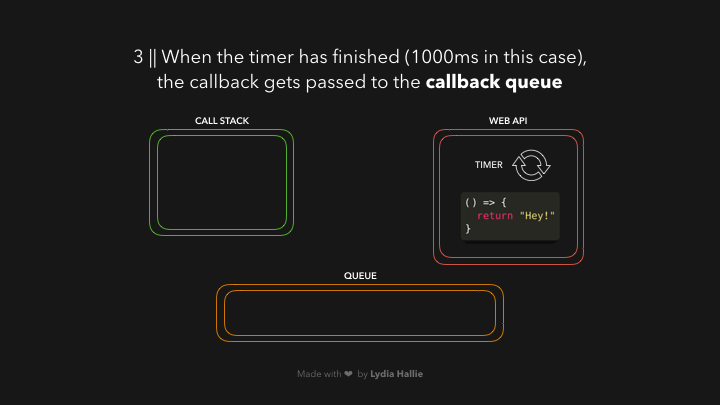

# Promise

## callbacks intro

- we often have to deal with `tasks that rely on other tasks`

```js
function loadScript(src, callback) {
  let script = document.createElement("script");
  script.src = src;
  script.onload = () => callback(script);
  document.head.append(script);
}

loadScript(
  "https://cdnjs.cloudflare.com/ajax/libs/lodash.js/3.2.0/lodash.js",
  (script) => {
    alert(`Cool, the script ${script.src} is loaded`);
    alert(_); // _ is a function declared in the loaded script
  }
);
```

- That’s the idea: the second argument is a `function` (usually anonymous) that `runs when the action is completed`

### Callback in callback

- another eg. we want to `get an image`, `compress it`, `apply a filter`, and `save it` 📸
- In the end, we'll end up with something like this:


- Although it's... fine, it's `not great`
- because it has `many nested callback functions` called `callback hell`
- that make the code quite `difficult to read`
- `promises can help` us in situations like these

## Promise Syntax

- represents an operation that `hasn't completed yet`, but is expected to in the future.
- It's a placeholder for the `result of an asynchronous operation`, providing a way to handle `success or failure` after the task is `finished`

A **real-life example** of a promise would be something like **ordering a pizza**.

- There are three possible outcomes:

1. The pizza is successfully delivered (fulfilled).
2. There is a problem with the order, and it cannot be delivered (rejected).
3. You're still waiting for the pizza to be delivered (pending).

### Pizza Order Example: Promise in JavaScript

Let’s model this using JavaScript promises.

```javascript
// Function to simulate ordering a pizza
function orderPizza(pizzaType) {
  return new Promise((resolve, reject) => {
    console.log(`Order placed for a ${pizzaType} pizza.`);

    setTimeout(() => {
      const isSuccessful = Math.random() > 0.2; // 80% chance the order will succeed

      if (isSuccessful) {
        resolve(`${pizzaType} pizza delivered! Enjoy!`);
      } else {
        reject(`Sorry, we couldn't deliver your ${pizzaType} pizza.`);
      }
    }, 3000); // Simulate a 3 second pizza delivery time
  });
}

// Placing the order
orderPizza("Margherita")
  .then((message) => {
    console.log(message); // Success handler: Pizza delivered!
  })
  .catch((error) => {
    console.log(error); // Error handler: Pizza not delivered
  })
  .finally(() => {
    console.log("Thank you for ordering with us."); // Final statement
  });
```

### Explanation:

1. **Promise Creation**:

   - The `orderPizza` function returns a new `Promise`.
   - Inside the promise, we simulate the pizza ordering process using `setTimeout` (which is asynchronous).
   - After 3 seconds, the promise either `resolves` (pizza delivered) or `rejects` (delivery failure), depending on a random success rate (80% chance of success in this case).

2. **`then()`**:

   - This is where the success case is handled. If the promise is fulfilled (pizza delivered), the message `"Pizza delivered! Enjoy!"` is printed.

3. **`catch()`**:

   - This handles the failure case. If the promise is rejected (delivery failed), an error message is printed.

4. **`finally()`**:
   - This block runs regardless of whether the promise was fulfilled or rejected. It thanks the customer for ordering, just like how a pizza place would always show appreciation whether the delivery succeeds or not.

### Real-Life Analogy:

- **Pending (Order in Progress)**: The pizza is being prepared and delivered.
- **Resolved (Fulfilled)**: The pizza is successfully delivered.
- **Rejected (Failed)**: Something went wrong, and the pizza couldn't be delivered.

By using promises, we can handle asynchronous operations in a clean and structured way, allowing us to manage success and failure cases efficiently.

## `.then` chain

- `.then` handlers can `solve callback hell problem`
- result of `.then` itself is a `promise value`
- can chain many as we want
- the result of the `previous then callback` will be `passed` as an `argument to the next then callback`


- for image example,


## Promise API

- There are `6 static methods` in the Promise class

### 1. `Promise.all`

- This method takes an `array of promises` and `returns a single promise` that `resolves when all the promises` in the array have resolved, or `rejects if any promise fails`

#### Real-Life Example: Ordering Multiple Pizzas

- Imagine you and your friends order several pizzas at the same time. You want to `start the party only after all pizzas are delivered`.

```js
// Simulating pizza orders with promises
const orderPizza1 = new Promise((resolve) =>
  setTimeout(() => resolve("Pizza 1 delivered"), 3000)
);
const orderPizza2 = new Promise((resolve) =>
  setTimeout(() => resolve("Pizza 2 delivered"), 2000)
);
const orderPizza3 = new Promise((resolve) =>
  setTimeout(() => resolve("Pizza 3 delivered"), 1000)
);

// Waiting for all pizzas to be delivered
Promise.all([orderPizza1, orderPizza2, orderPizza3])
  .then((pizzas) => {
    console.log("All pizzas delivered:", pizzas);
    // Output: All pizzas delivered: ['Pizza 1 delivered', 'Pizza 2 delivered', 'Pizza 3 delivered']
  })
  .catch((error) => {
    console.log("One of the pizza orders failed:", error);
  });
```

### 2. `Promise.allSettled`

- This method `returns a promise that resolves` when `all promises have either resolved or rejected`, with an array of objects that describes the `outcome of each promise`.

#### Real-Life Example: Status of Multiple Pizza Orders

- You order several pizzas and you want to know the status of all of them, even if some deliveries fail

```js
const pizza1 = new Promise((resolve) =>
  setTimeout(() => resolve("Pizza 1 delivered"), 3000)
);
const pizza2 = new Promise((_, reject) =>
  setTimeout(() => reject("Pizza 2 failed to deliver"), 2000)
);
const pizza3 = new Promise((resolve) =>
  setTimeout(() => resolve("Pizza 3 delivered"), 1000)
);

// Checking the status of all pizza deliveries
Promise.allSettled([pizza1, pizza2, pizza3]).then((results) => {
  console.log("All pizza statuses:", results);
  // Output:
  // [
  //   { status: 'fulfilled', value: 'Pizza 1 delivered' },
  //   { status: 'rejected', reason: 'Pizza 2 failed to deliver' },
  //   { status: 'fulfilled', value: 'Pizza 3 delivered' }
  // ]
});
```

### 3. `Promise.race`

- This method `returns a promise that resolves or rejects as soon as one of the promises in the array resolves or rejects`. The result of the `first completed promise` is returned.

#### Real-Life Example: Pizza Delivery Race

- You and your friends are racing to see which pizza is delivered first.

```js
const pizza1 = new Promise((resolve) =>
  setTimeout(() => resolve("Pizza 1 delivered"), 3000)
);
const pizza2 = new Promise((resolve) =>
  setTimeout(() => resolve("Pizza 2 delivered"), 2000)
);
const pizza3 = new Promise((resolve) =>
  setTimeout(() => resolve("Pizza 3 delivered"), 1000)
);

// Racing to see which pizza is delivered first
Promise.race([pizza1, pizza2, pizza3])
  .then((winner) => {
    console.log("The first pizza delivered is:", winner);
    // Output: The first pizza delivered is: Pizza 3 delivered
  })
  .catch((error) => {
    console.log("One of the pizza orders failed:", error);
  });
```

### 4. `Promise.any`

- This method returns a `single promise that resolves as soon as any of the promises resolves`. If all promises reject, it returns a rejection.

#### Real-Life Example: First Pizza that Successfully Delivers

- You order multiple pizzas, and you just want to know as soon as any pizza arrives, ignoring any failed deliveries.

```js
const pizza1 = new Promise((_, reject) =>
  setTimeout(() => reject("Pizza 1 failed to deliver"), 3000)
);
const pizza2 = new Promise((resolve) =>
  setTimeout(() => resolve("Pizza 2 delivered"), 2000)
);
const pizza3 = new Promise((resolve) =>
  setTimeout(() => resolve("Pizza 3 delivered"), 1000)
);

// Getting the first successfully delivered pizza
Promise.any([pizza1, pizza2, pizza3])
  .then((firstDelivered) => {
    console.log("First pizza delivered is:", firstDelivered);
    // Output: First pizza delivered is: Pizza 3 delivered
  })
  .catch((error) => {
    console.log("No pizza was delivered:", error);
  });
```

# Event Loop

- The Event Loop is a core concept in JavaScript that `helps manage asynchronous tasks`, `allowing non-blocking I/O` while `still being single-threaded`.

#### Event Loop in JavaScript: Code Example

```js
console.log("Chef starts working");

// Synchronous task: Preparing a salad
console.log("Chef makes a salad");

// Asynchronous task: Putting a pizza in the oven (setTimeout represents baking time)
setTimeout(() => {
  console.log("Pizza is baked and ready to serve!");
}, 10000); // Pizza takes 10 seconds to bake

// Synchronous task: Preparing another salad
console.log("Chef makes another salad");

console.log("Chef continues working while waiting for the pizza");
```

- `Call Stack`: The chef's immediate tasks (preparing salads).
- `Task Queue`: The pizza being in the oven (waiting for a timer to complete).
- `Event Loop`: The chef (or JavaScript runtime) keeps an eye on both. As soon as the synchronous tasks are finished (salads are done), the chef can take the asynchronous callback (the pizza) from the Task Queue and finish that too.





- lets see one example

```js
const foo = () => console.log("First");
const bar = () => setTimeout(() => console.log("Second"), 500);
const baz = () => console.log("Third");

bar();
foo();
baz();
```


# Microtasks and (Macro)tasks

| (Macro)task  |      Microtask      |
| :----------- | :-----------------: |
| setTimeout   |  process.nextTick   |
| setInterval  |  Promise callback   |
| setImmediate | queueMicrotask neat |

### The event loop gives a different priority to the tasks:

1. All `functions` in that are currently in the call stack get `executed`. When they `returned a value`, they get `popped off the stack`. eg.`Task1`

2. `event loop` checks if `call stack is empty`. if empty, all queued up `microtasks` are `popped` onto the callstack `one by one`, and get `executed`. eg.`Task2`,`Task3`, `Task4`

3. `event loop` checks if both the `call stack and microtask queue are empty`.if empty, all queued up `macrotasks` are `popped` onto the callstack `one by one`, and get `executed`. eg.`Task5`,`Task6`

```
- Microtasks has higher priority than (Macro)tasks
- Microtasks will execute first
- Microtasks > (Macro)tasks
```


- lets see with the example


# Async/Await

- introduced in `ES7`
- `async` and `await` keywords, we can create `async` functions which implicitly return a promise


