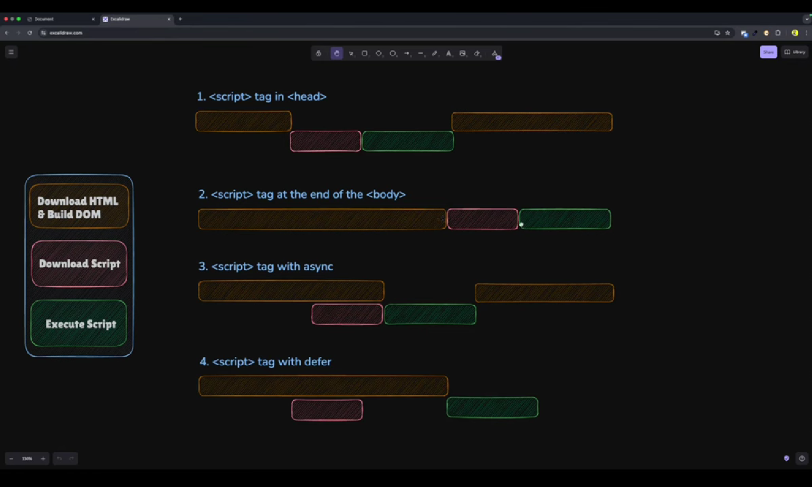

# What is JavaScript?

- created to `make web pages alive`

- `lightweight`, `prototype - based`, `single - threaded`, `dynamic language`, `object - oriented`, `interpreted` or `just-in-time compiled` programming language

- can execute not only in the `browser`, but also on the `server` <br/>eg.`Node.js`,`Apache CouchDB`

- JavaScript engines :
  - ` "V8" – in Chrome, Opera and Edge`
  - `"SpiderMonkey" – in Firefox`
  - `"Chakra" - in IE`
  - `"JavaScriptCore", "Nitro" and "SquirrelFish" - in Safari`, etc

---

# How do engines (translator) work?

```
parse(read)  =>  compiles(translate)  =>  run
```

---

# How to link with HTML ?

- for `inline` js

  ```html
  <a href="#" onclick="alert(this)">Click Me</a>
  ```

- for `internal` file

  ```html
  <script>
    ....
  </script>
  ```

- for `external` file

  ```html
  <script src="path/to/script.js"></script>
  ```

---

# Async Vs Defer In Javascript

## `async` attribute

- script will be `fetched in parallel to html parsing` and `evaluated as soon as it is available` (potentially before parsing completes).

## `defer` attribute

- script will be `fetched in parallel` and `evaluated when the page has finished parsing`



## ✅ Best Practice Summary

| Use Case                     | Recommended Method      |
| ---------------------------- | ----------------------- |
| DOM-dependent scripts        | `<script defer>`        |
| Independent/external scripts | `<script async>`        |
| Fallback/simple HTML         | End of `<body>`         |
| Critical early scripts       | Avoid blocking `<head>` |

---

# What is “use strict” ?

- always at the `top` of your scripts

- with Strict mode you cannot use any variable before initializing it.

```js
// note: no "use strict" in this example

num = 5; // the variable "num" is created if it didn't exist

alert(num); // 5
```

```js
"use strict";

num = 5; // error: num is not defined
```

- Declared inside a `function`, it has `local scope` (only the code inside the function is in strict mode)

```js
x = 3.14; // This will not cause an error.
myFunction();

function myFunction() {
  "use strict";
  y = 3.14; // This will cause an error
}
```

- `Modern JS` supports “classes” and “modules” – advanced language structures, that `enable use strict automatically`. So we don’t need to add the "use strict" directive, if we use them.

---

# Alert, Prompt and Confirm

## alert

- `shows a message` and waits for the user to press “OK”

```js
alert("Hello");
```

## prompt

- `takes input` from user
- The function prompt accepts `two` arguments:

```js
result = prompt(title, [default]);

let age = prompt('How old are you?', 100);

alert(`You are ${age} years old!`); // You are 100 years old!
```

## confirm

- The function confirm `shows a modal` window with a question and two buttons: `OK` and `Cancel`

- The result is `true if OK` is pressed and `false otherwise`

```js
let isBoss = confirm("Are you the boss?");

alert(isBoss); // true if OK is pressed
```

---

# Timing Events

- The window object allows execution of code at `specified time intervals`.

- These time intervals are called `timing events`.

- The two key methods to use with JavaScript are：

  - `setTimeout(function, milliseconds)`

    - `Executes a function, after waiting a specified number of milliseconds.`

  - `setInterval(function, milliseconds)`

    - Same as setTimeout(), but `repeats the execution of the function continuously.`

  ex :

  ```html
  <button onclick="setTimeout(myFunction, 3000)">Try it</button>

  <script>
    function myFunction() {
      alert("Hello");
    }
  </script>
  ```

<br />

---

## 🔄 How JavaScript Sees Code

JavaScript processes our code in multiple phases:

<div align="center">

```
┌─────────────┐     ┌─────────┐     ┌─────────────┐     ┌──────────┐
│  TOKENIZING  │ → │  PARSING  │ → │ INTERPRETING │ → │ EXECUTION │
└──────┬──────┘     └────┬────┘     └──────┬──────┘     └─────┬────┘
       │                 │                  │                  │
       ▼                 ▼                  ▼                  ▼
┌──────────────┐  ┌───────────────┐  ┌────────────────┐  ┌───────────────┐
│ Break code   │  │ Create AST    │  │ Convert to     │  │ Run the code  │
│ into tokens  │  │ (Abstract     │  │ machine code   │  │ line by line  │
│              │  │ Syntax Tree)  │  │                │  │               │
└──────────────┘  └───────────────┘  └────────────────┘  └───────────────┘
```

</div>

### 1️⃣ Tokenizing

- JavaScript breaks down the code into individual tokens
- Tokens are the smallest units of code like keywords, operators, identifiers
- Validates that these tokens follow ECMAScript syntax rules

For example, `let name = "John";` becomes tokens:

- Keyword: `let`
- Identifier: `name`
- Operator: `=`
- String literal: `"John"`
- Semicolon: `;`

### 2️⃣ Parsing

- Tokens are organized into a tree structure called Abstract Syntax Tree (AST)
- AST represents the grammatical structure of the code
- It helps JavaScript understand how the tokens relate to each other

### 3️⃣ Interpreting (Compiling)

- The JavaScript engine converts the AST into machine code
- In modern engines, this includes Just-In-Time (JIT) compilation for better performance

### 4️⃣ Execution

- The compiled code is executed line by line
- Memory is allocated for variables
- Operations are performed as specified

---
