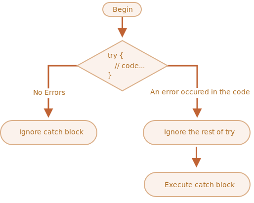

# Error handling

## The “try…catch” syntax

- try...catch that allows us to “catch” errors so the script can, instead of dying, do something more reasonable.

```js
try {
  // code...
} catch (err) {
  // error handling
}
```

### It works like this:

1. First, the code in try {...} is executed.
2. If there were no errors, then catch (err) is ignored
3. If an error occurs, then the try execution is stopped, and control flows to the beginning of catch (err)



- An example with an error: shows (1) and (3)

```js
try {
  alert("Start of try runs"); // (1) <--

  lalala; // error, variable is not defined!

  alert("End of try (never reached)"); // (2)
} catch (err) {
  alert(`Error has occurred!`); // (3) <--
}
```

### try...catch only works for runtime errors

- For try...catch to work, the code must be runnable.
- it should be valid JavaScript.

```js
try {
  {{{{{{{{{{{{  // SyntaxError: Unexpected token 'catch'
} catch (err) {
   // catch block will not execute
  alert("The engine can't understand this code, it's invalid");
}
```

### try...catch works synchronously

- If an exception happens in “scheduled” code, like in setTimeout, then try...catch won’t catch it

```js
try {
  setTimeout(function () {
    noSuchVariable; // script will die here
  }, 1000);
} catch (err) {
  alert("won't work");
}
```

- That’s because the function itself is executed later, when the engine has already left the try...catch construct.

- To catch an exception inside a scheduled function, try...catch must be inside that function

```js
setTimeout(function () {
  try {
    noSuchVariable; // try...catch handles the error!
  } catch {
    alert("error is caught here!");
  }
}, 1000);
```

## Error object

- When an error occurs, JavaScript generates an object containing the details about it.
- The object is then passed as an argument to catch

```js
try {
  // ...
} catch (err) {
  // <-- the "error object", could use another word instead of err
  // ...
}
```

### For all built-in errors, the error object has two main properties:

- `message` – the human-readable error message.
- `name` – the string with error name (error constructor name).
- `stack` (non-standard, but well-supported) – the stack at the moment of error creation.

```js
try {
  lalala; // error, variable is not defined!
} catch (err) {
  alert(err.name); // ReferenceError
  alert(err.message); // lalala is not defined
  alert(err.stack); // ReferenceError: lalala is not defined at (...call stack)

  // Can also show an error as a whole
  // The error is converted to string as "name: message"
  alert(err); // ReferenceError: lalala is not defined
}
```

### Optional “catch” binding

- If we don’t need error details, catch may omit it:

```js
try {
  // ...
} catch {
  // <-- without (err)
  // ...
}
```

## Throwing our own errors

### “Throw” operator

- The throw operator generates an error.
- The syntax is:

```js
throw <error object>
```

- JavaScript has many built-in constructors for standard errors: Error, SyntaxError, ReferenceError, TypeError and others. We can use them to create error objects as well.
- We can use instanceof to check for particular errors.

```js
let error = new Error(message);
// or
let error = new SyntaxError(message);
let error = new ReferenceError(message);
// ...

let error = new Error("Things happen o_O");

alert(error.name); // Error
alert(error.message); // Things happen o_O
```

```js
let json = '{ "age": 30 }'; // incomplete data

try {
  let user = JSON.parse(json); // <-- no errors

  if (!user.name) {
    throw new SyntaxError("Incomplete data: no name"); // (*)
  }

  alert(user.name);
} catch (err) {
  alert("JSON Error: " + err.message); // JSON Error: Incomplete data: no name

  if (err instanceof SyntaxError) {
    alert("Our custom error"); // "ReferenceError" for accessing an undefined variable
  }
}
```

## try…catch…finally

- If finally exists, it runs in all cases
  - after try, if there were no errors,
  - after catch, if there were errors.

```js
try {
  //... try to execute the code ...
} catch (err) {
  //... handle errors ...
} finally {
  //... execute always ...
}
```

## Global catch

- in the browser we can assign a function to the special window.onerror property, that will run in case of an uncaught error.

```js
window.onerror = function (message, url, line, col, error) {
  // ...
};
```

- `message`
  - Error message.
- `url`
  - URL of the script where error happened.
- `line, col`
  - Line and column numbers where error happened.
- `error`
  - Error object.

## Custom errors, extending Error

- We can inherit from Error and other built-in error classes normally
- We just need to take care of the name property and don’t forget to call super.

```js
// The "pseudocode" for the built-in Error class defined by JavaScript itself
class Error {
  constructor(message) {
    this.message = message;
    this.name = "Error"; // (different names for different built-in error classes)
    this.stack = <call stack>; // non-standard, but most environments support it
  }
}
```

- Now let’s inherit ValidationError from it and try it in action:

```js
class ValidationError extends Error {
  constructor(message) {
    super(message);
    this.name = "ValidationError";
  }
}

// Usage
function readUser(json) {
  let user = JSON.parse(json);

  if (!user.age) {
    throw new ValidationError("No field: age");
  }
  if (!user.name) {
    throw new ValidationError("No field: name");
  }

  return user;
}

// Working example with try..catch

try {
  let user = readUser('{ "age": 25 }');
} catch (err) {
  if (err instanceof ValidationError) {
    alert("Invalid data: " + err.message); // Invalid data: No field: name
  } else if (err instanceof SyntaxError) {
    // (*)
    alert("JSON Syntax Error: " + err.message);
  } else {
    throw err; // unknown error, rethrow it (**)
  }
}
```
