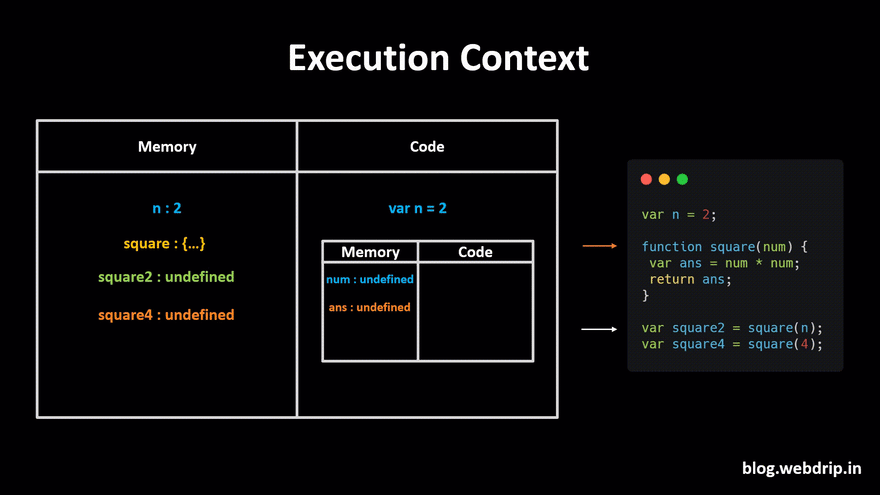
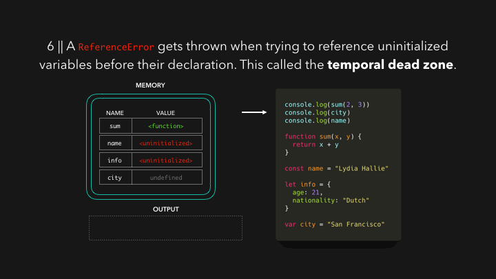
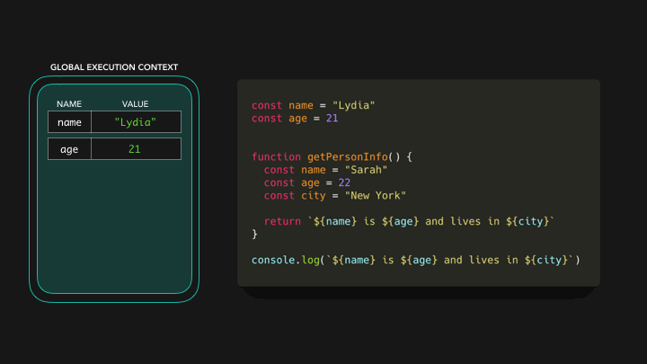

# How JavaScript Works

- Everything in JavaScript happens `inside an Execution Context`
- assume this Execution context to be a `big container`
- In this container, there are two components

  1. `Memory component`
  2. `Code component`

### Memory component

- `variables and functions are stored as key-value pairs`
- also known as `variable environment`

### Code component

- is a place in the container where `code is executed one line at a time`
- also known as `Thread of Execution`


## Execution of the code

- Let's take a simple example,

```js
var a = 2;
var b = 4;

var sum = a + b;

console.log(sum);
```


## How Functions Are Called In Execution Context?

```js
var n = 2;

function square(num) {
  var ans = num * num;
  return ans;
}

var square2 = square(n);
var square4 = square(4);
```





# Call Stack

- When a function is `invoked` in JavaScript, JavaScript creates an `execution context`
- JavaScript manages `code execution context creation` and `deletion` with the the help of Call Stack

```js
function a() {
  function insideA() {
    return true;
  }
  insideA();
}
a();
```


# Hoisting

- hoisting is a behavior where `variable and function declarations` are moved ("hoisted") to the `top of their containing scope` during the `compilation phase`, before the code is executed.
- `Functions` and `variables` are stored in `memory` for an `execution context` before we execute our code. This is called `hoisting`.

## Hoisting Behavior:

1. Variables declared with `var are hoisted` but `initialized with undefined`.
2. Variables declared with `let and const are hoisted` but `not initialized` (they exist in the "temporal dead zone" until their declaration is encountered).
3. Function declarations are `hoisted along with their definitions`, meaning you can call the function before the actual declaration.

```js
console.log(orderDetails); // Output: undefined (because of hoisting)

// console.log(paymentMethod); // Error: Cannot access 'paymentMethod' before initialization
// TDZ prevents access until the declaration is encountered.

// processOrder(); // This will work fine because of function hoisting

var orderDetails = "Pizza, 2 sodas";
let paymentMethod = "Credit Card";

function processOrder() {
  console.log("Processing order for:", orderDetails);
}

processOrder(); // Works fine because function declarations are hoisted
```





# scope chain

- it is the `hierarchy of scopes` that determines `how variables are accessed in nested functions`.
- When a variable is used `inside a function`, JavaScript first looks for it in the `current scope`, and if it’s `not found`, it moves up the scope chain to the `outer scope`, and `so on`, until it reaches the `global scope`.
- If the variable `isn't found anywhere`, it results in a `reference error`.




- Real-Life Example: `Restaurant Kitchen` (Scope Chain)

- If the chef needs an ingredient, they:

1. First check their personal station.
2. If it’s not there, they check the section pantry.
3. If it’s still not found, they go to the global pantry.

- This search process represents the scope chain.

```js
// Global Pantry (Global Scope)
let globalIngredient = "Flour";

function kitchenSection() {
  // Section Pantry (Function Scope)
  let sectionIngredient = "Cheese";

  function chefStation() {
    // Chef's Personal Station (Inner Function Scope)
    let stationIngredient = "Spices";

    // Chef checks their personal station first
    console.log(stationIngredient); // "Spices"

    // If not found, the chef checks the section pantry
    console.log(sectionIngredient); // "Cheese"

    // If still not found, the chef checks the global pantry
    console.log(globalIngredient); // "Flour"
  }

  chefStation();
}

kitchenSection();
```

# Lexical Scope

- lexical scope means that the `visibility of variables` is determined by `where they are written in the code`, `not where or how they are executed`.

- In other words, an item's lexical scope is the `place in which the item got created`

- `Inner functions` can access variables from their `own scope` and any `outer scope`, but `not vice versa`

- Real-Life Example: `Office Building (Lexical Scope)`

- Imagine an office building with multiple floors:

1. `Each floor represents a scope`
2. Employees on each floor can access files that are `located on their floor` (local scope).
3. Employees can also access files on the `floors above them` (outer scope), but `not on the floors below them`

```js
// Top floor (Global Scope)
let topFloorDocument = "Global Document";

function middleFloor() {
  // Middle floor (Function Scope)
  let middleFloorDocument = "Middle Floor Document";

  function basement() {
    // Basement (Inner Function Scope)
    let basementDocument = "Basement Document";

    // Employees in the basement can access all documents
    console.log(topFloorDocument); // Accessible
    console.log(middleFloorDocument); // Accessible
    console.log(basementDocument); // Accessible
  }

  // Employees on the middle floor can access their own and top floor documents
  console.log(topFloorDocument); // Accessible
  console.log(middleFloorDocument); // Accessible
  // console.log(basementDocument); // Error: Not accessible from middle floor

  basement();
}

middleFloor();
```

# Closures

- A closure in JavaScript occurs when a function is able to `remember the variables` from its `lexical scope`, even when that `function is executed outside of that scope`.
- In other words, a closure allows a function to `access variables from an outer function` even after the `outer function has finished executing`.
- Example: `Bank Account Using Closures`

```js
function createBankAccount(initialBalance) {
  // The `balance` is private
  let balance = initialBalance;

  return {
    // Function to deposit money into the account
    deposit: function (amount) {
      if (amount > 0) {
        balance += amount;
        console.log(`Deposited: $${amount}. New balance: $${balance}`);
      } else {
        console.log("Invalid deposit amount");
      }
    },

    // Function to withdraw money from the account
    withdraw: function (amount) {
      if (amount > 0 && amount <= balance) {
        balance -= amount;
        console.log(`Withdrew: $${amount}. New balance: $${balance}`);
      } else {
        console.log("Insufficient funds or invalid amount");
      }
    },

    // Function to check the current balance
    checkBalance: function () {
      console.log(`Current balance: $${balance}`);
      return balance;
    },
  };
}

// Creating a new bank account with an initial balance of $1000
const myAccount = createBankAccount(1000);

// Using the closure to interact with the bank account
myAccount.deposit(500); // Deposits $500
myAccount.withdraw(200); // Withdraws $200
myAccount.checkBalance(); // Prints the current balance
```

### debounce example

```js
function debounce(fn, delay) {
  let timeId;
  return function (...args) {
    let context = this;
    !!timeId && clearTimeout(timeId);
    timeId = setTimeout(() => {
      fn.apply(context, args);
    }, delay);
  };
}
```

### throttle example

```js
function throttle(fn, delay) {
  let timeId = null;
  return function (...args) {
    let context = this;
    if (timeId) return;
    fn.apply(context, args);
    timeId = setTimeout(() => {
      timeId = null;
    }, delay);
  };
}
```

### Simple Addition with Memoization

```js
function memoizeAdd() {
  const cache = {};

  return function (a, b) {
    const key = `${a},${b}`; // Use a string key to store result for inputs a and b

    if (key in cache) {
      console.log("Fetching from cache:", key);
      return cache[key];
    }

    console.log("Calculating result:", key);
    const result = a + b;
    cache[key] = result;

    return result;
  };
}

const add = memoizeAdd();

console.log(add(3, 5)); // Output: 8 (calculated)
console.log(add(3, 5)); // Output: 8 (fetched from cache)
console.log(add(10, 15)); // Output: 25 (calculated)
console.log(add(10, 15)); // Output: 25 (fetched from cache)
```

### Memoization with Closures Example

```js
// Fibonacci Function Without Memoization (Inefficient)
function fibonacci(n) {
  if (n <= 1) return n;
  return fibonacci(n - 1) + fibonacci(n - 2);
}

console.log(fibonacci(10)); // 55

// Fibonacci Function With Memoization (efficient)
function memoizedFibonacci() {
  // This cache object stores the results of the previous Fibonacci calculations.
  const cache = {};

  // This function uses the cache to avoid recalculating values.
  return function fib(n) {
    // Check if the result is already in the cache
    if (n in cache) {
      return cache[n];
    }

    // Base cases: Fibonacci(0) = 0, Fibonacci(1) = 1
    if (n <= 1) {
      cache[n] = n;
      return n;
    }

    // Recursively calculate the Fibonacci value and store it in the cache
    cache[n] = fib(n - 1) + fib(n - 2);

    // Return the cached result
    return cache[n];
  };
}

const fib = memoizedFibonacci();

console.log(fib(10)); // 55
console.log(fib(50)); // 12586269025 (computed much faster)
```

**[Interview questions](https://roadsidecoder.hashnode.dev/closures-javascript-interview-questions)**

# Currying

- Instead of taking all arguments at once, the function takes the `first argument`, `returns a new function` that takes the `second argument`, and so on, `until all arguments have been provided`
- Real-Life Example: `Coffee Shop Order`

Imagine you're at a `coffee shop ordering a customized drink`. Instead of giving all your preferences at once, the barista asks for your choices `step by step`.

1. First, you choose the type of drink (e.g., latte, cappuccino).
2. Next, you specify the size (e.g., small, medium, large).
3. Finally, you choose any extra options (e.g., extra shot of espresso, syrup).

At each step, the barista asks for more information and finalizes the order only after you've provided all the details.

```js
// Currying function for placing a coffee order
function orderCoffee(drinkType) {
  return function (size) {
    return function (extra) {
      return `Order placed: ${size} ${drinkType} with ${extra}`;
    };
  };
}

// Placing the order step by step
const orderLatte = orderCoffee("Latte");
const orderMediumLatte = orderLatte("Medium");
const finalOrder = orderMediumLatte("an extra shot of espresso");
// can be called by another way
const anotherFinalOrder = orderCoffee("cappuccino")("Large")(
  "an extra shot of espresso"
);

console.log(finalOrder); // Output: Order placed: Medium Latte with an extra shot of espresso
console.log(anotherFinalOrder); // Output: Order placed: Large cappuccino with an extra shot of espresso
```

- Benefits of Currying:
- `Reuse Functions`: You can reuse parts of the function. For example, you can create a partially applied function like `orderLatte` for all latte orders, without needing to specify the drink type every time.

- `Customization`: Currying allows you to break down the `logic into smaller pieces`, making it easier to compose and customize function behavior.

```js
function sum(a, b, c) {
  return a + b + c;
}
sum(1, 2, 3); // 6

function sum(a) {
  return (b) => {
    return (c) => {
      return a + b + c;
    };
  };
}

const add = (a) => (b) => (c) => a + b + c;

console.log(sum(1)(2)(3)); // 6
console.log(add(1)(2)(3)); // 6
```

- It helps you avoid passing the same variable again and again
- It helps to create a higher order function

```js
// Another Example of a curried function

const multiply = (x, y) => x * y;

const curriedMultiply = x => y => x * y;

console.log(multiply(2, 3));

console.log(curriedMultiply(2));  // y => x * y
console.log(curriedMultiply(2)(3)); // 6


// Partially applied functions are a common use of currying
const timesTen = curriedMultiply(10);

console.log(timesTen); // y => x * y
console.log(timesTen(8)); // 80

// Another example

const updateElemText = id => content => document.querySelector(`#${id}`).
textContent = content;

Const updateHeaderText = updateElemText("header");
updateHeaderText("Hello Dave!");

// Another example
let log = (time) => (type) => (msg) =>
  `At ${time.toLocaleString()}: severity ${type} => ${msg}`;

log(new Date())("error")("power not sufficient");

let logNow = log(new Date());

logNow("warning")("temp high");

let logErrorNow = log(new Date())("error");

logErrorNow("unknown error");
```

- normal function to curried function

```js
const curry = (fn) => {
  return (curried = (...args) => {
    if (fn.length !== args.length) {
      return curried.bind(null, ...args);
    }
    return fn(...args);
  });
};

const total = (a, b, c) => a + b + c;
const curriedTotal = curry(total);
curriedTotal(10)(20)(30); //60
```
