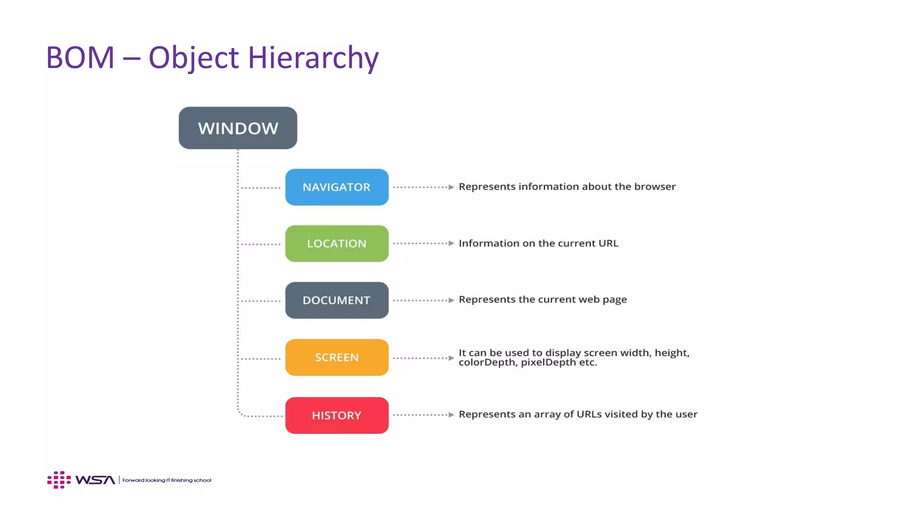

# DOM

---

## 1. `What is the DOM?`

- `tree-like structure` representing an HTML document.
- `Nodes` in the DOM tree include:

  - `Element nodes`: `<div>`, `<p>`, ``, etc.
  - `Text nodes`: Content within elements.
  - `Attribute nodes`: Represent attributes like `class`, `id`, etc.
  - `Document node`: The root of the DOM tree.

- DOM is not part of JavaScript but an API provided by browsers.

---

## 2. `DOM Tree Structure`

The DOM structure follows a hierarchy:

- `Root Node`: `document`
- `Element Nodes`: HTML elements (e.g., `<body>`, `<div>`).
- `Text Nodes`: Text inside an element.
- Example:
  ```html
  <div id="example">
    <p>Hello, World!</p>
  </div>
  ```
  DOM Tree:
  - `document`
    - `html`
      - `body`
        - `div#example`
          - `p`
            - Text: "Hello, World!"

---

## 3. `Accessing the DOM`

### Using `document` Object

The `document` object represents the whole HTML document. Common methods include:

- `Access by ID`: `getElementById()`

  ```javascript
  const element = document.getElementById("example");
  console.log(element);
  ```

- `Access by Class`: `getElementsByClassName()`

  ```javascript
  const elements = document.getElementsByClassName("className");
  console.log(elements);
  ```

- `Access by Tag`: `getElementsByTagName()`

  ```javascript
  const paragraphs = document.getElementsByTagName("p");
  console.log(paragraphs);
  ```

- `Query Selectors`:
  - Single Element: `querySelector()`
    ```javascript
    const firstDiv = document.querySelector("div");
    console.log(firstDiv);
    ```
  - Multiple Elements: `querySelectorAll()`
    ```javascript
    const allDivs = document.querySelectorAll("div");
    console.log(allDivs);
    ```

---

## 4. `DOM Manipulation`

### Modifying Content

- `Change Inner Content`:

  ```javascript
  const para = document.querySelector("p");
  para.textContent = "New Content";
  para.innerHTML = "<strong>New Content</strong>";
  ```

- `Add/Remove Elements`:
  ```javascript
  const newElement = document.createElement("div");
  newElement.textContent = "Added Div";
  document.body.appendChild(newElement);
  document.body.removeChild(newElement);
  ```

### Changing Attributes

- `Get/Set Attributes`:

  ```javascript
  const img = document.querySelector("img");
  img.setAttribute("src", "image.jpg");
  console.log(img.getAttribute("src"));
  ```

- `Class Manipulation`:
  ```javascript
  const element = document.querySelector("div");
  let numb = element.classList.length;
  element.classList.add("new-class");
  element.classList.remove("old-class");
  element.classList.toggle("active-class");
  element.classList.contains("myStyle");
  ```

### Inline Styles

- `Modify Style`:
  ```javascript
  const box = document.querySelector(".box");
  box.style.backgroundColor = "blue";
  box.style.fontSize = "16px";
  ```

---

## 5. `Event Handling`

### Adding Events

- `Inline Event` (Not recommended):

  ```html
  <button onclick="alert('Clicked!')">Click Me</button>
  ```

- `Using `addEventListener()``:
  ```javascript
  const button = document.querySelector("button");
  button.addEventListener("click", () => {
    alert("Button Clicked!");
  });
  button.removeEventListener("mousemove", myFunction);
  ```

### Event Properties

- `event.target`: Element that triggered the event.
- `event.type`: Type of the event (e.g., 'click', 'mouseover').
- Example:
  ```javascript
  button.addEventListener("click", (event) => {
    console.log(event.target);
  });
  ```

---

## 6. `Traversal in DOM`

### Navigating Between Nodes

- `Parent Node`:

  ```javascript
  const child = document.querySelector(".child");
  console.log(child.parentNode);
  ```

- `Child Nodes`:

  ```javascript
  const parent = document.querySelector(".parent");
  console.log(parent.childNodes); // Includes text nodes
  console.log(parent.children); // Element nodes only
  ```

- `Sibling Nodes`:
  ```javascript
  const item = document.querySelector(".item");
  console.log(item.nextSibling); // Next node (any type)
  console.log(item.nextElementSibling); // Next element node
  ```

---

## 7. `Best Practices for Working with the DOM`

- Minimize DOM access as it's a performance bottleneck.
- Use `event delegation` to handle events efficiently.
  ```javascript
  document.querySelector("ul").addEventListener("click", (event) => {
    if (event.target.tagName === "LI") {
      console.log("List item clicked:", event.target.textContent);
    }
  });
  ```
- Prefer `querySelector`/`querySelectorAll` for flexibility.
- Use `DocumentFragment` for batch updates to minimize reflows.

---

# BOM (Browser Object Model)

- provides a way `to interact with the browser window and its components`.
- Unlike the DOM, which deals with webpage content, BOM focuses on browser-specific objects like the `window`, `screen`, `history`, `location`, and `navigator`.



## `The `window` Object`

- The `window` object is the `global object in browsers.`
- All BOM components are `properties or methods` of the `window` object.

### Common `window` Properties and Methods:

- `Global Variables`: Any variable declared globally becomes a property of the `window` object.

  ```javascript
  var a = 10;
  console.log(window.a); // 10
  ```

- `Dialog Boxes`:

  - `alert(message)`
  - `confirm(message)`
  - `prompt(message, defaultValue)`

  ```javascript
  alert("Hello, world!");
  const isConfirmed = confirm("Are you sure?");
  const name = prompt("What's your name?", "Guest");
  ```

- `Timers`:

  - `setTimeout(function, delay)`
  - `setInterval(function, interval)`
  - `clearTimeout(id)`
  - `clearInterval(id)`

  ```javascript
  const timeoutId = setTimeout(() => console.log("Hello after 2s"), 2000);
  clearTimeout(timeoutId); // Cancels the timeout
  ```

- `Window Size`:

  ```javascript
  console.log(window.innerWidth); // Viewport width
  console.log(window.innerHeight); // Viewport height
  ```

- `Opening and Closing Windows`:
  ```javascript
  const newWindow = window.open(
    "https://example.com",
    "_blank",
    "width=400,height=400"
  );
  newWindow.close();
  ```

---

## `navigator` Object

The `navigator` object `provides information` about the `browser and user’s device.`

### Common Properties:

- `navigator.userAgent`: Returns the browser’s `user agent string.`

  ```javascript
  console.log(navigator.userAgent);
  ```

- `navigator.platform`: Returns the `operating system.`

  ```javascript
  console.log(navigator.platform);
  ```

- `navigator.language`: Returns the `browser's language.`

  ```javascript
  console.log(navigator.language);
  ```

- `navigator.geolocation`: Provides `access to the user’s location` (requires user permission).
  ```javascript
  navigator.geolocation.getCurrentPosition((position) => {
    console.log(position.coords.latitude, position.coords.longitude);
  });
  ```

---

## `screen` Object`

The `screen` object contains `information about the user’s screen.`

### Common Properties:

- `screen.width`: The width of the screen.
- `screen.height`: The height of the screen.
- `screen.availWidth`: The width of the screen excluding OS UI.
- `screen.availHeight`: The height of the screen excluding OS UI.

Example:

```javascript
console.log(screen.width, screen.height);
console.log(screen.availWidth, screen.availHeight);
```

---

## `location` Object

The `location` object provides `information about the URL of the current page` and `allows navigation to other pages.`

### Common Properties:

- `location.href`: The full URL.
- `location.hostname`: The domain name.
- `location.pathname`: The path of the URL.
- `location.protocol`: The protocol (e.g., `http:` or `https:`).

### Methods:

- `location.reload()`: Reloads the current page.
- `location.assign(url)`: Navigates to a new URL.
- `location.replace(url)`: Replaces the current URL without creating a history entry.

Example:

```javascript
console.log(location.href);
location.reload(); // Reloads the page
location.assign("https://example.com");
```

---

## `history` Object`

The `history` object allows navigation through the browser’s session history.

### Common Methods:

- `history.back()`: Goes to the previous page.
- `history.forward()`: Goes to the next page.
- `history.go(n)`: Navigates to a specific page in the history stack.

  ```javascript
  history.go(-1); // Go back one page
  history.go(2); // Go forward two pages
  ```

- `history.length`: Returns the number of entries in the history stack.
  ```javascript
  console.log(history.length);
  ```

---

### Cookies

- Cookies let you `store user information` in web pages.

- When a `web server has sent a web page` to a browser, the `connection is shut down`, and the `server forgets everything` about the user.

- Cookies were `invented to solve the problem "how to remember information about the user"`

- Cookies are saved in `name-value pairs` like：

  ```
  username = John Doe
  ```

- When a browser requests a web page from a server, `cookies belonging to the page is added to the request`. This way the server gets the necessary data to "remember" information about users.

- JavaScript can `create, read, and delete cookies` with the document.cookie property.

  ```javascript
  document.cookie =
    "username=John Doe; expires=Thu, 18 Dec 2013 12:00:00 UTC; path=/";
  ```

  > You can also add an `expiry date` (in UTC time). `By default, the cookie is deleted when the browser is closed`

  > With a path parameter, you can tell the browser `what path the cookie belongs `to. `By default, the cookie belongs to the current page`.

- If you want `to find the value of one specified cookie`, you must `write a JavaScript function` that searches for the cookie value in the cookie string.

- The `Domain` and `Path` directives `define the scope of the cookie`.

- If Domain is specified, then subdomains are always included.

  > For example, if `Domain=mozilla.org` is set, then cookies are included on subdomains like `developer.mozilla.org`.

---

### Web Storage

- can `store data locally` within the user's browser.

- `Before HTML5`, application data had to be `stored in cookies`, included in every server request.

- Unlike cookies, the `storage limit is far larger` (at least 5MB) and `information is never transferred to the server`.

- `Web storage is per origin` (per `domain` and `protocol`). All pages, from one origin, can store and access the same data.

- Web storage provides two objects for storing data on the client：

  - `window.localStorage` - stores data `with no expiration date`
  - `window.sessionStorage` - `stores data for one session` (data is lost when the browser tab is closed)

---


