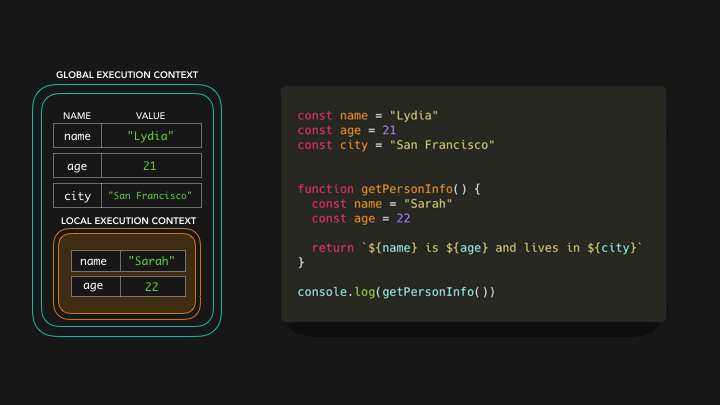

# Variables

- used to `store information` and use them later

- can `change` information later (var, let)

```js
let message; // undefined

message = "Hello"; // Hello

message = "World"; // value changed to `World`

alert(message); // World
```

- `declare multiple variables` in one line
  <br/>

```js
let user = "John",
  age = 25,
  message = "Hello";
```

## Variable naming

- name `must contain` only `letters`, `digits`, or the symbols `$ and \_`

```js
let userName;
let test123;

let $ = 1; // declared a variable with the name "$"
let _ = 2; // and now a variable with the name "_"
alert($ + _); // 3
```

- `first` character must `not be a digit`

```js
let 1a;
```

- hyphens `-` are `not allowed` in the name

```js
let my-name;
```

- `Case sensitive`

```js
// both variables are different
let apple = "...";
let APPLE = "...";
```

- `Non-Latin` letters are `allowed`, but `not recommended`

```js
let имя = "...";
```

- `can't use reserved words`

```js
let let = 5;
let return = 5;
```

## `var` vs `let` vs `const`

|                                         | var                                            | let                                            | const                                               |
| --------------------------------------- | ---------------------------------------------- | ---------------------------------------------- | --------------------------------------------------- |
| Redeclaration                           | YES                                            | NO                                             | NO                                                  |
| Reassignment</br>(can change its value) | YES                                            | YES                                            | NO                                                  |
| Must be Assigned                        | NO<br/>var name;<br/>name = 'Shubham'; //valid | NO<br/>let name;<br/>name = 'Shubham'; //valid | YES<br/>const PI;<br/>PI = 3.14159265359; //invalid |
| Block Scope                             | NO<br/>(functional scope)                      | YES                                            | YES                                                 |

- If you re-declare with `var` only, it will not lose its value.

```js
var carName = "Volvo";
var carName; // Volvo

-----------------------

let message = "This";
let message = "That"; // SyntaxError: 'message' has already been declared
```

# scope

- A variable can be declared at `different scope`
- Variables scopes can be:

  1. `Global`
  2. `Local`

- Anything declared `without let, var or const` is scoped at `global level`

```js
//scope.js
a = "JavaScript"; // declaring a variable without let or const make it available in window object and this found anywhere
b = 10; // this is a global scope variable and found in the window object
function letsLearnScope() {
  console.log(a, b); // JavaScript 10
  if (true) {
    console.log(a, b); // JavaScript 10
  }
}
console.log(a, b); // JavaScript 10
```

## Global scope

A globally declared variable can be `accessed every where in the same file`

```js
//scope.js
let a = "JavaScript"; // is a global scope it will be found anywhere in this file
let b = 10; // is a global scope it will be found anywhere in this file
function letsLearnScope() {
  console.log(a, b); // JavaScript 10, accessible
  if (true) {
    let a = "Python";
    let b = 100;
    console.log(a, b); // Python 100
  }
  console.log(a, b);
}
letsLearnScope();
console.log(a, b); // JavaScript 10, accessible
```

## Local scope

- A variable declared as local can be accessed only in certain block code
  1. `Block Scope`
  2. `Function Scope`

```js
//scope.js
let a = "JavaScript"; // is a global scope it will be found anywhere in this file
let b = 10; // is a global scope it will be found anywhere in this file
// Function scope
function letsLearnScope() {
  console.log(a, b); // JavaScript 10, accessible
  let value = false;
  // block scope
  if (true) {
    // we can access from the function and outside the function but
    // variables declared inside the if will not be accessed outside the if block
    let a = "Python";
    let b = 20;
    let c = 30;
    let d = 40;
    value = !value;
    console.log(a, b, c, value); // Python 20 30 true
  }
  // we can not access c because c's scope is only the if block
  console.log(a, b, value); // JavaScript 10 true
}
letsLearnScope();
console.log(a, b); // JavaScript 10, accessible
```

## understanding of scope

- A variable declared with `var` only scoped to `function`
- variable declared with `let` or `const` is `block scope`(function block, if block, loop block, etc)
- Block in JavaScript is a code in between `two curly brackets` ({}).

```js
//scope.js
function letsLearnScope() {
  var gravity = 9.81;
  console.log(gravity);
}
// console.log(gravity), Uncaught ReferenceError: gravity is not defined

if (true) {
  var gravity = 9.81;
  console.log(gravity); // 9.81
}
console.log(gravity); // 9.81

for (var i = 0; i < 3; i++) {
  console.log(i); // 0, 1, 2
}
console.log(i); // 3
```

- When we use `let/const`, our variable is block scoped and it will not infect other parts of our code

```js
//scope.js
function letsLearnScope() {
  // you can use let or const, but gravity is constant I prefer to use const
  const gravity = 9.81;
  console.log(gravity);
}
// console.log(gravity), Uncaught ReferenceError: gravity is not defined

if (true) {
  const gravity = 9.81;
  console.log(gravity); // 9.81
}
// console.log(gravity), Uncaught ReferenceError: gravity is not defined

for (let i = 0; i < 3; i++) {
  console.log(i); // 0, 1, 2
}
// console.log(i), Uncaught ReferenceError: i is not defined
```

- Let's take a look at the following code

```js
const name = "Lydia";
const age = 21;
const city = "San Francisco";

function getPersonInfo() {
  const name = "Sarah";
  const age = 22;

  return `${name} is ${age} and lives in ${city}`;
}

console.log(getPersonInfo());
```

- First, `memory space` is set up for the different contexts
- We have the default `global context` (window in a browser, global in Node)
- and a `local context for the getPersonInfo function` which has been invoked
- Each context also has a `scope chain`




- In order to find the value for city the engine `goes to outer scopes`
- You can go to `outer scopes`, but `not to more inner`


- if variable not found in any scope, it throws `ReferenceError`


