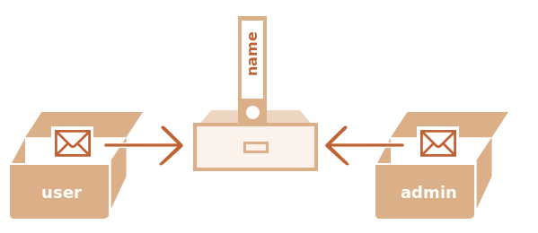

# Objects

- used to `store keyed collections` of various data

- A property is a `key: value` pair

- `key is a string`, and `value can be anything`

### empty object can be created using one of two syntaxes:

```js
let user = new Object(); // "object constructor" syntax
let user = {}; // "object literal" syntax

let user = {
  // an object
  name: "John", // by key "name" store value "John"
  age: 30, // by key "age" store value 30
  "likes birds": true, // multiword property name must be quoted
};
```

### To access a property

- dot notation: `obj.property`
- Square brackets notation `obj["property"]`

```js
alert(user.name); // John
alert(user.age); // 30
OR;
alert(user["likes birds"]); // true
```

- `add a property`

```js
user.isAdmin = true;
```

- To `remove a property`, use the `delete` operator

```js
delete user.age;
```

### Computed properties

- can use `square brackets in an object literal`, when creating an object. That’s called `computed properties`

```js
let fruit = "apple";

let bag = {
  [fruit]: 5, // the name of the property is taken from the variable fruit
  [fruit + "Juice"]: 2, // bag.appleJuice = 5
};

alert(bag.apple); // 5 if fruit="apple"
```

### Property value shorthand

```js
function makeUser(name, age) {
  return {
    name, // same as name: name
    age, // same as age: age
    address: "Pune",
  };
}
```

### Property names limitations

- `variable cannot` have a name equal to one of the `language-reserved` words like “for”, “let”, “return” etc.

- But for an `object property, there’s no such restriction`

```js
// these properties are all right
let obj = {
  for: 1,
  let: 2,
  return: 3,
};

alert(obj.for + obj.let + obj.return); // 6
```

- Other types are `automatically converted to strings`

```js
let obj = {
  0: "test", // same as "0": "test"
};

// both alerts access the same property (the number 0 is converted to string "0")
alert(obj["0"]); // test
alert(obj[0]); // test (same property)
```

### Property existence test, “in” operator

```js
let user = { name: "John", age: 30 };

alert("age" in user); // true, user.age exists
alert("blabla" in user); // false, user.blabla doesn't exist
```

### iterate object

- use `for..in` loop

```js
let user = {
  name: "John",
  age: 30,
  isAdmin: true,
};

for (let key in user) {
  // keys
  alert(key); // name, age, isAdmin
  // values for the keys
  alert(user[key]); // John, 30, true
}
```

### Creating object methods

- `getFullName` is function inside the person object and we call it an object method
- can use the word `this` to `access the values of different properties of the object itself`

```js
const person = {
  firstName: "Asabeneh",
  lastName: "Yetayeh",
  age: 25,
  skills: ["HTML", "CSS", "JavaScript", "React"],
  isMarried: true,
  getFullName: function () {
    // "this" is the "current object"
    return `${this.firstName} ${this.lastName}`;
  },
};

console.log(person.getFullName());
// Asabeneh Yetayeh
```

# "this" Keyword

## **Global Context**

In the global context or outside of any function, `this` refers to the global object:

- In browsers, it's the `window` object.
- In Node.js, it's `global`.

Example:

```javascript
console.log(this); // In a browser: window, in Node.js: global
```

---

## **Inside Functions**

### a. **Regular Function**

- `this` refers to the `global object` (`window` in browsers) in non-strict mode. In strict mode, `this` is `undefined`.

Example:

```javascript
function showThis() {
  console.log(this); // window (non-strict), undefined (strict mode)
}

showThis();
```

### b. **Inside Methods**

When `this` is used inside an object method, it refers to the object that owns the method.

Example:

```javascript
const obj = {
  name: "JavaScript",
  getName: function () {
    return this.name; // Refers to obj
  },
};

console.log(obj.getName()); // "JavaScript"
```

---

### c. **Arrow Function**

- do not have their own `this`. They inherit `this` from the enclosing context.

Example:

```javascript
const obj = {
  name: "JavaScript",
  showThis: () => {
    console.log(this); // Refers to the enclosing scope, not obj
  },
};

obj.showThis(); // window (or global in Node.js)
```

---

## **Inside Constructors and Classes**

In a constructor function or class, `this` refers to the instance being created.

### Constructor Example:

```javascript
function Person(name) {
  this.name = name;
}

const person = new Person("John");
console.log(person.name); // "John"
```

### Class Example:

```javascript
class Person {
  constructor(name) {
    this.name = name;
  }
}

const person = new Person("John");
console.log(person.name); // "John"
```

---

## **Explicitly Setting `this`**

You can explicitly set the value of `this` using `call`, `apply`, or `bind`.

### a. **call()**

Calls a function with a specified `this` value and arguments.

```javascript
function greet(greeting) {
  console.log(`${greeting}, ${this.name}`);
}

const user = { name: "Alice" };
greet.call(user, "Hello"); // "Hello, Alice"
```

### b. **apply()**

Similar to `call()`, but takes arguments as an array.

```javascript
greet.apply(user, ["Hi"]); // "Hi, Alice"
```

### c. **bind()**

Returns a new function with a specified `this` value.

```javascript
const boundGreet = greet.bind(user);
boundGreet("Welcome"); // "Welcome, Alice"
```

---

## **Event Handlers**

### a. Default Behavior

In DOM event handlers, `this` refers to the element that fired the event.

```javascript
document.querySelector("button").addEventListener("click", function () {
  console.log(this); // The button element
});
```

### b. Arrow Functions in Event Handlers

Arrow functions inherit `this` from the surrounding context.

```javascript
document.querySelector("button").addEventListener("click", () => {
  console.log(this); // window or global context
});
```

### Object Methods

- `Object.assign` : To `copy` an object without modifying the original object

```js
const person = {
  firstName: "Asabeneh",
  city: "Mumbai",
  getPersonInfo: function () {
    return `I am ${this.firstName} and I live in ${this.city}`;
  },
};

const copyPerson = Object.assign({}, person);
console.log(copyPerson);
```

#### Getting object keys using Object.keys()

- `Object.keys` : To get the keys or properties of an object as an array

```js
const keys = Object.keys(copyPerson);
console.log(keys); //['firstName', 'city', 'getPersonInfo']
```

#### Getting object values using Object.values()

- `Object.values` :To get values of an object as an array

```js
const values = Object.values(copyPerson);
console.log(values); //['Asabeneh', 'Mumbai', ƒ]
```

#### Getting object keys and values using Object.entries()

- `Object.entries` :To get the keys and values in an array

```js
const entries = Object.entries(copyPerson);
console.log(entries);
```

```sh
[
    ['firstName', 'Asabeneh'],
    ['city', 'Mumbai'],
    ['getPersonInfo', ƒ]
]
```

#### Checking properties using hasOwnProperty()

- `hasOwnProperty`: To check if a specific key or property exist in an object

```js
console.log(copyPerson.hasOwnProperty("name"));
console.log(copyPerson.hasOwnProperty("score"));
```

### Object references and copying

- objects are stored and copied `by reference`
- where as primitive values are always copied `as a whole value`

```js
// we put a copy of message into phrase
let message = "Hello!";
let phrase = message;
```

- result we have `two independent variables`, if we change in `phrase`,it will not affect `message`


- Objects are `not` like that

```js
let user = { name: "John" };

let admin = user; // copy the reference

admin.name = "Pete"; // changed by the "admin" reference

alert(user.name); // 'Pete', changes are seen from the "user" reference
```

- When an `object variable is copied, the reference is copied`, but the object itself is `not duplicated`
- one object, but now with `two variables that reference it`



#### Comparison by reference

```js
// a and b reference the same object
let a = {};
let b = a; // copy the reference

alert(a == b); // true, both variables reference the same object
alert(a === b); // true

// two independent objects
let a = {};
let b = {}; // two independent objects

alert(a == b); // false
alert(a === b); // false
```

#### NOTE :

- `const` objects can be `modified`

```js
const user = {
  name: "John",
};

user.name = "Pete"; // (*)

alert(user.name); // Pete
```

- The value of `user is constant`, it must always `reference the same object`, but `properties are free to change`

### Cloning and merging, Object.assign

1. can create a `new object` and `replicate the structure of the existing one`

```js
let user = {
  name: "John",
  age: 30,
};

let clone = {}; // the new empty object

// let's copy all user properties into it
for (let key in user) {
  clone[key] = user[key];
}

// now clone is a fully independent object with the same content
clone.name = "Pete"; // changed the data in it

alert(user.name); // still John in the original object
```

2. We can also use the method `Object.assign`
   The syntax is:

```js
Object.assign(dest, ...sources);
```

- The first argument dest is a `target object`
- Further arguments is a `list of source objects`

#### merge objects

```js
let user = { name: "John" };

let permissions1 = { canView: true };
let permissions2 = { canEdit: true };

// copies all properties from permissions1 and permissions2 into user
Object.assign(user, permissions1, permissions2);

// now user = { name: "John", canView: true, canEdit: true }
```

#### clone objects

```js
let user = {
  name: "John",
  age: 30,
};

let clone = Object.assign({}, user);

alert(clone.name); // John
alert(clone.age); // 30
```

### Nested cloning

```js
let user = {
  name: "John",
  sizes: {
    height: 182,
    width: 50,
  },
};

let clone = Object.assign({}, user);

alert(user.sizes === clone.sizes); // true, same object

// user and clone share sizes
user.sizes.width = 60; // change a property from one place
alert(clone.sizes.width); // 60, get the result from the other one
```

- if it’s an nested object, then replicate its structure as well. That is called a `deep cloning` or `structured cloning`
- There’s `structuredClone` method that implements deep cloning

```js
let user = {
  name: "John",
  sizes: {
    height: 182,
    width: 50,
  },
};

let clone = structuredClone(user);

alert(user.sizes === clone.sizes); // false, different objects

// user and clone are totally unrelated now
user.sizes.width = 60; // change a property from one place
alert(clone.sizes.width); // 50, not related
```

- use `Object.assign` for the so-called `shallow copy` (nested objects are copied by reference) or a `deep cloning` function `structuredClone` or use a `custom cloning implementation`

### Constructor function

- technically are `regular functions`
- There are two conventions though:

  - starts with `capital letter`
  - should be executed only with `new` operator

```js
function User(name) {
  this.name = name;
  this.isAdmin = false;
}

let user = new User("Jack");

alert(user.name); // Jack
alert(user.isAdmin); // false
```

- When a function is executed with new, it does the following steps:

  1. A new `empty object is created` and `assigned` to this
  2. The function body executes. Usually it `modifies this`, `adds new properties` to it
  3. The `value of this` is returned

```js
function User(name) {
  // this = {};  (implicitly)

  // add properties to this
  this.name = name;
  this.isAdmin = false;

  // return this;  (implicitly)
}
```

- main purpose of constructors – `to implement reusable object creation code`

#### Omitting parentheses

```js
// let user = new User;  // <-- no parentheses
// same as
// let user = new User();
```

### Optional chaining '?.'

- The `non-existing property` problem

```js
let user = {}; // a user without "address" property

alert(user.address.street); // Error!
// to fix it
alert(user.address ? user.address.street : undefined);

// document.querySelector('.elem') is null if there's no element
let html = document.querySelector(".elem").innerHTML; // error if it's null
// to fix it
let html = document.querySelector(".elem")
  ? document.querySelector(".elem").innerHTML
  : null;
```

- For more deeply nested properties, it becomes even uglier, as more repetitions are required.

```js
let user = {}; // user has no address

alert(
  user.address ? (user.address.street ? user.address.street.name : null) : null
);
// OR
alert(user.address && user.address.street && user.address.street.name);
```

#### Optional chaining

- The optional chaining `?.` stops the evaluation if the value before `?.` is `undefined or null` and returns `undefined`

```js
let user = {}; // user has no address

alert(user?.address?.street); // undefined (no error)
```

- `variable before ?. must be declared`

```js
//if not, ReferenceError: user is not defined
user?.address;
```

#### The optional chaining ?. syntax has three forms:

1. `obj?.prop` – returns obj.prop if obj exists, otherwise `undefined`
2. `obj?.[prop] OR obj?.[index]` – returns obj[prop] OR obj[index] if obj exists, otherwise `undefined`

```js
let user1 = {
  firstName: "John",
  skills: ["html", "css", "js"],
};

let user2 = null;

alert(user1?.["firstName"]); // John
alert(user2?.["firstName"]); // undefined
alert(user1?.["skills"]?.[0]); // html
alert(user2?.["skills"]?.[0]); // undefined
```

3. `obj.method?.()` – calls obj.method() if obj.method exists, otherwise returns `undefined`

```js
let userAdmin = {
  admin() {
    alert("I am admin");
  },
};

let userGuest = {};

userAdmin.admin?.(); // I am admin

userGuest.admin?.(); // nothing happens (no such method)
```

# Map

- `a collection of keyed values`.
- The differences from a regular Object:
  - `Any keys`, `objects` can be keys.
  - Additional convenient methods, the `size` property.
- Methods and properties are:
  - `new Map()` – creates the map.
  - `map.set(key, value)` – stores the value by the key.
  - `map.get(key)` – returns the value by the key, undefined if key doesn’t exist in map.
  - `map.has(key)` – returns true if the key exists, false otherwise.
  - `map.size` – returns the current element count.
  - `map.delete(key)` – removes the element (the key/value pair) by the key.
  - `map.clear()` – removes everything from the map.

```js
let map = new Map();

map.set("1", "str1"); // a string key
map.set(1, "num1"); // a numeric key
map.set(true, "bool1"); // a boolean key

// remember the regular Object? it would convert keys to string
// Map keeps the type, so these two are different:
alert(map.get(1)); // 'num1'
alert(map.get("1")); // 'str1'

alert(map.size); // 3

alert(map.get("2")); // false
```

- Map can also use objects as keys.

```js
let john = { name: "John" };

// for every user, let's store their visits count
let visitsCountMap = new Map();

// john is the key for the map
visitsCountMap.set(john, 123);

alert(visitsCountMap.get(john)); // 123
```

- Every map.set call returns the map itself, so we can “chain” the calls

```js
map.set("1", "str1").set(1, "num1").set(true, "bool1");
```

## Iteration over Map

- For looping over a map, there are 3 methods:

- `map.keys()` – returns an iterable for keys,
- `map.values()` – returns an iterable for values,
- `map.entries()` – returns an iterable for entries [key, value], it’s used by default in for..of.

```js
let recipeMap = new Map([
  ["cucumber", 500],
  ["tomatoes", 350],
  ["onion", 50],
]);

// iterate over keys (vegetables)
for (let vegetable of recipeMap.keys()) {
  alert(vegetable); // cucumber, tomatoes, onion
}

// iterate over values (amounts)
for (let amount of recipeMap.values()) {
  alert(amount); // 500, 350, 50
}

// iterate over [key, value] entries
for (let entry of recipeMap) {
  // the same as of recipeMap.entries()
  alert(entry); // cucumber,500 (and so on)
}
```

- The insertion order is used
