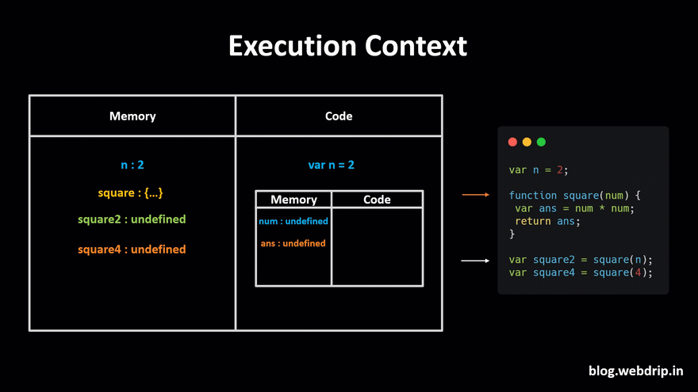
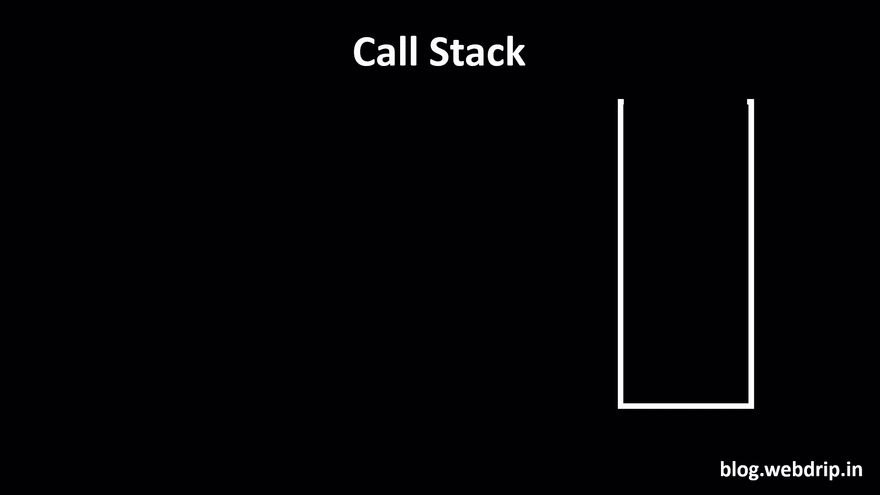

# How JavaScript Works

- Everything in JavaScript happens `inside an Execution Context`
- assume this Execution context to be a `big container`
- In this container, there are two components

  1. `Memory component`
  2. `Code component`

### Memory component

- `variables and functions are stored as key-value pairs`
- also known as `variable environment`

### Code component

- is a place in the container where `code is executed one line at a time`
- also known as `Thread of Execution`
- JS is a synchronous, single-threaded language
  - Synchronous:- In a specific synchronous order.
  - Single-threaded:- One command at a time.


---

## Execution of the code

- Let's take a simple example,

```js
var a = 2;
var b = 4;

var sum = a + b;

console.log(sum);
```


## How Functions Are Called In Execution Context?

```js
var n = 2;

function square(num) {
  var ans = num * num;
  return ans;
}

var square2 = square(n);
var square4 = square(4);
```





---

### 🧠 Execution Context in JavaScript

1. **Global Execution Context (GEC)** is created when a JS program runs.
2. Execution Context is created in **two phases**:

   - **Memory Creation Phase**
   - **Code Execution Phase**

---

### 🗃️ Memory Creation Phase

1. JS scans the code line-by-line before execution.
2. **Allocates memory** to variables and functions:

   - Variables like `n`, `square2`, and `square4` are initialized with `undefined`.
   - Functions like `square` store the **entire function definition** in memory.

**Example Code:**

```js
var n = 2;
function square(num) {
  var ans = num * num;
  return ans;
}
var square2 = square(n);
var square4 = square(4);
```

---

### ⚙️ Code Execution Phase

1. JS re-scans the code, now executes line-by-line.
2. Updates variables with actual values:

   - `n` becomes `2`.
   - `square2 = square(n)` → calls `square(2)`, creates a new execution context.
   - `square4 = square(4)` → calls `square(4)`, creates another execution context.

---

### 🌀 Function Execution Context

1. When a function is invoked, a **new execution context** is created.

2. It also goes through:

   - **Memory Creation Phase** → memory allocated to `num`, `ans` as `undefined`.
   - **Code Execution Phase**:

     - `num = 2`
     - `ans = num * num` → calculates result
     - `return ans` → returns value and **destroys function execution context**

3. Same steps repeat for every function call.

---

### 🏗️ Call Stack in JavaScript

1. **Call Stack** manages multiple execution contexts.
2. It helps JS keep track of function calls and where to return.
3. Stack structure:

   - GEC is at the **bottom**.
   - New function calls are **pushed** on top.
   - After completion, they are **popped off** the stack.

---

# Call Stack

- When a function is `invoked` in JavaScript, JavaScript creates an `execution context`
- JavaScript manages `code execution context creation` and `deletion` with the the help of Call Stack

```js
function a() {
  function insideA() {
    return true;
  }
  insideA();
}
a();
```



---

# Event Loop

- The Event Loop is a core concept in JavaScript that `helps manage asynchronous tasks`, `allowing non-blocking I/O` while `still being single-threaded`.

#### Event Loop in JavaScript: Code Example

```js
console.log("Chef starts working");

// Synchronous task: Preparing a salad
console.log("Chef makes a salad");

// Asynchronous task: Putting a pizza in the oven (setTimeout represents baking time)
setTimeout(() => {
  console.log("Pizza is baked and ready to serve!");
}, 10000); // Pizza takes 10 seconds to bake

// Synchronous task: Preparing another salad
console.log("Chef makes another salad");

console.log("Chef continues working while waiting for the pizza");
```

- `Call Stack`: The chef's immediate tasks (preparing salads).
- `Task Queue`: The pizza being in the oven (waiting for a timer to complete).
- `Event Loop`: The chef (or JavaScript runtime) keeps an eye on both. As soon as the synchronous tasks are finished (salads are done), the chef can take the asynchronous callback (the pizza) from the Task Queue and finish that too.


- lets see one example

```js
const foo = () => console.log("First");
const bar = () => setTimeout(() => console.log("Second"), 500);
const baz = () => console.log("Third");

bar();
foo();
baz();
```


---

# Microtasks and (Macro)tasks

| (Macro)task  |      Microtask      |
| :----------- | :-----------------: |
| setTimeout   |  process.nextTick   |
| setInterval  |  Promise callback   |
| setImmediate | queueMicrotask neat |

### The event loop gives a different priority to the tasks:

1. All `functions` in that are currently in the call stack get `executed`. When they `returned a value`, they get `popped off the stack`. eg.`Task1`

2. `event loop` checks if `call stack is empty`. if empty, all queued up `microtasks` are `popped` onto the callstack `one by one`, and get `executed`. eg.`Task2`,`Task3`, `Task4`

3. `event loop` checks if both the `call stack and microtask queue are empty`.if empty, all queued up `macrotasks` are `popped` onto the callstack `one by one`, and get `executed`. eg.`Task5`,`Task6`

```
- Microtasks has higher priority than (Macro)tasks
- Microtasks will execute first
- Microtasks > (Macro)tasks
```


- lets see with the example


---
