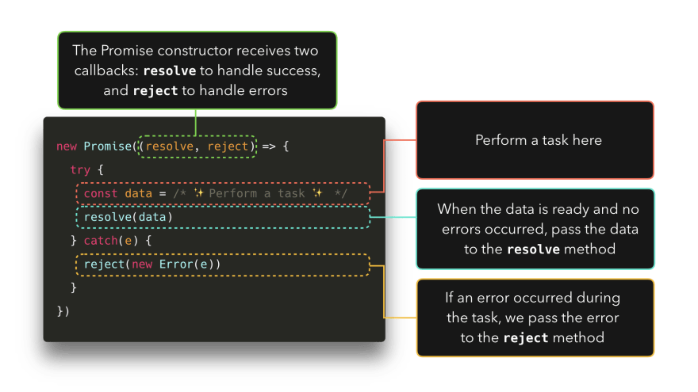
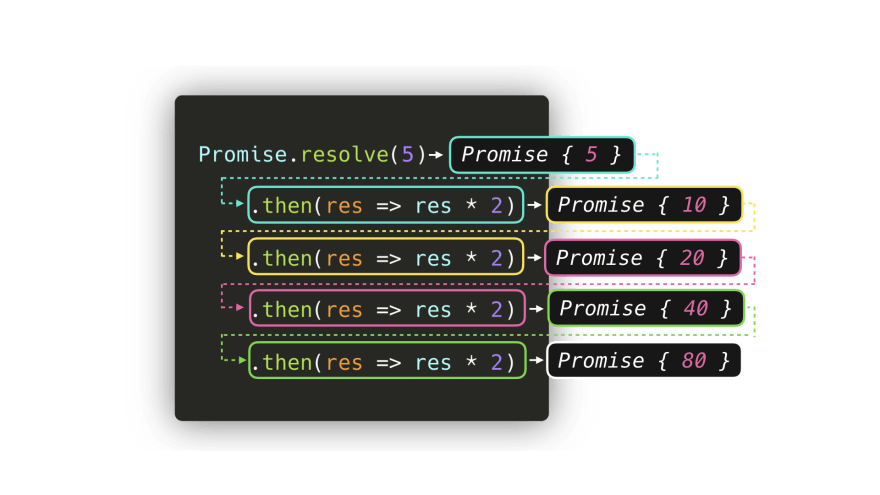

# Promise

- we often have to deal with `tasks that rely on other tasks`
- eg. we want to `get an image`, `compress it`, `apply a filter`, and `save it` 📸
- In the end, we'll end up with something like this:


- Although it's... fine, it's `not great`
- because it has `many nested callback functions` called `callback hell`
- that make the code quite `difficult to read`
- `promises can help` us in situations like these

## Promise Syntax

- `ES6` introduced Promises
- A `promise` is a `placeholder for a value` that can either `resolve or reject` at some time in the `future`

```js
new Promise(() => {});
```

- it returns

```sh
Promise {<pending>}
[[Prototype]]: Promise
[[PromiseState]]: "pending"
[[PromiseResult]]: undefined
```

- A Promise is an `object` that contains a `status`, ([[PromiseStatus]]) and a `value` ([[PromiseValue]])

### The value of the PromiseStatus, `the state`, can be one of three values:

- ✅ `fulfilled`: The promise has been `resolved`. Everything `went fine`, no errors occurred within the promise 🥳

```js
new Promise((res, rej) => {
  res("yay!");
});
```

```sh
Promise {<fulfilled>}
[[Prototype]]: Promise
[[PromiseState]]: "fulfilled"
[[PromiseResult]]: "yay!"
```

- ❌ `rejected` : The promise has been `rejected`. Argh, something `went wrong`

```js
new Promise((res, rej) => {
  rej("oh no!");
});
```

```sh
Promise {<rejected>}
[[Prototype]]: Promise
[[PromiseState]]: "rejected"
[[PromiseResult]]: "oh no!"
```

- ⏳ `pending`: The promise has `neither resolved nor rejected` (yet), the promise is still `pending`



- lets see previous image example


### there are built-in methods to get a promise's value. To a promise, we can attach 3 methods

- `.then()` : Gets called after a promise `resolved`
- `.catch()` : Gets called after a promise `rejected`
- `.finally()` : `Always gets called`, whether the promise resolved or rejected

#### `IF RESOLVE`


#### `IF REJECT`


## `.then` chain

- `.then` handlers can `solve callback hell problem`
- result of `.then` itself is a `promise value`
- can chain many as we want
- the result of the `previous then callback` will be `passed` as an `argument to the next then callback`



- for image example,


# Event Loop

- JS is `single-threaded` : `only one` task can `run at a time`
- if a task which takes 30 seconds..During that task we’re waiting for 30 seconds before anything else can happen😬
- results a `slow`, `unresponsive website`
- Luckily, the `browser` gives us some features that the `JavaScript engine itself doesn’t provide`: a `WEB API`
- This includes the `DOM API`, `setTimeout`, `HTTP requests`, and so on...
- This can help us create some `async`, `non-blocking` behavior 🚀


- lets see one example

```js
const foo = () => console.log("First");
const bar = () => setTimeout(() => console.log("Second"), 500);
const baz = () => console.log("Third");

bar();
foo();
baz();
```


# Microtasks and (Macro)tasks

| (Macro)task  |      Microtask      |
| :----------- | :-----------------: |
| setTimeout   |  process.nextTick   |
| setInterval  |  Promise callback   |
| setImmediate | queueMicrotask neat |

### The event loop gives a different priority to the tasks:

1. All `functions` in that are currently in the call stack get `executed`. When they `returned a value`, they get `popped off the stack`. eg.`Task1`

2. `event loop` checks if `call stack is empty`. if empty, all queued up `microtasks` are `popped` onto the callstack `one by one`, and get `executed`. eg.`Task2`,`Task3`, `Task4`

3. `event loop` checks if both the `call stack and microtask queue are empty`.if empty, all queued up `macrotasks` are `popped` onto the callstack `one by one`, and get `executed`. eg.`Task5`,`Task6`

```
- Microtasks has higher priority than (Macro)tasks
- Microtasks will execute first
- Microtasks > (Macro)tasks
```


- lets see with the example


# Async/Await

- introduced in `ES7`
- `async` and `await` keywords, we can create `async` functions which implicitly return a promise


